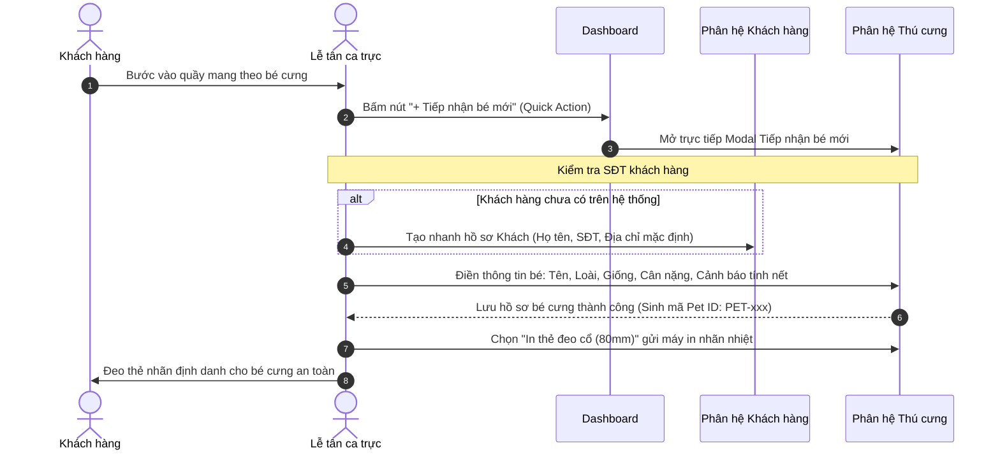
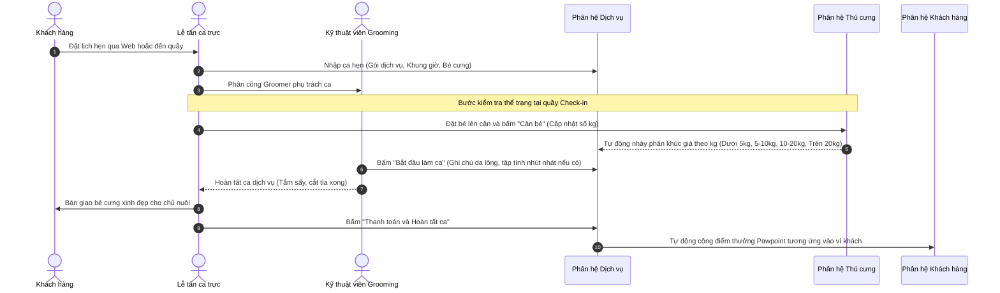
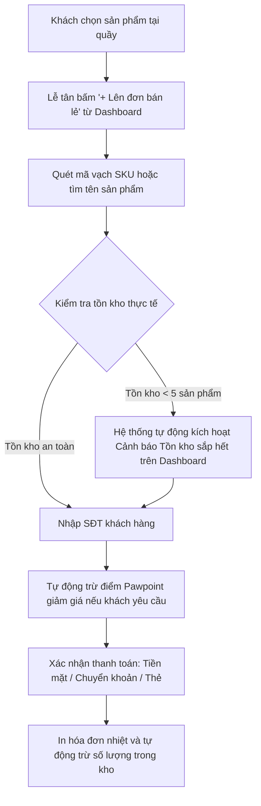
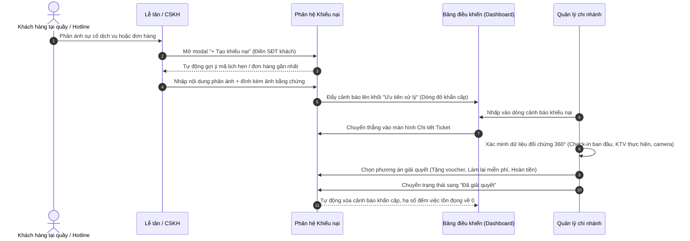
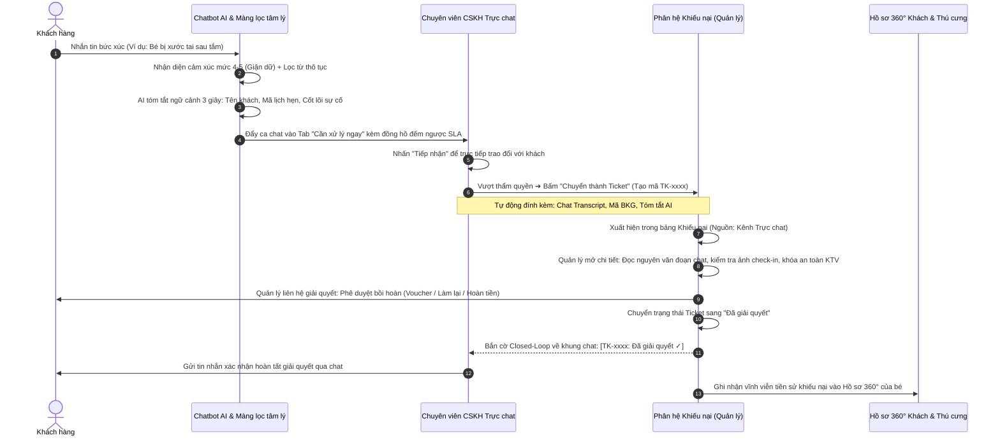

# SỔ TAY VẬN HÀNH VÀ HƯỚNG DẪN LUỒNG NGHIỆP VỤ HỆ THỐNG QUẢN TRỊ PAWPAL-ER

> **Dành cho:** Ban Quản lý cửa hàng, Lễ tân ca trực, Chuyên viên Chăm sóc khách hàng và Kỹ thuật viên Spa/Grooming.  
> **Phiên bản:** 2.0 (Chuẩn hóa quy tắc thiết kế `AGENTS.md` và luồng nghiệp vụ liên phân hệ).

---

## MỤC LỤC
1. [Tổng quan hệ sinh thái và Nguyên tắc cốt lõi](#1-tổng-quan-hệ-sinh-thái-và-nguyên-tắc-cốt-lõi)
2. [Sơ đồ luồng nghiệp vụ liên phân hệ (Cross-Module Workflows)](#2-sơ-đồ-luồng-nghiệp-vụ-liên-phân-hệ)
   - [Luồng 1: Tiếp nhận khách hàng và bé cưng mới tại quầy](#luồng-1-tiếp-nhận-khách-hàng-và-bé-cưng-mới-tại-quầy-walk-in)
   - [Luồng 2: Đặt lịch, Đo thể trạng và Thực hiện dịch vụ Spa / Hotel](#luồng-2-đặt-lịch-đo-thể-trạng-và-thực-hiện-dịch-vụ)
   - [Luồng 3: Bán hàng tại quầy và Quản trị tồn kho](#luồng-3-bán-hàng-tại-quầy-và-quản-trị-tồn-kho)
   - [Luồng 4: Tiếp nhận và Xử lý Khiếu nại / Đổi trả theo SLA](#luồng-4-tiếp-nhận-và-xử-lý-khiếu-nại--đổi-trả-theo-sla)
   - [Luồng 5: Giám sát Trợ lý Chatbot AI và Chuyển giao nhân viên](#luồng-5-giám-sát-trợ-lý-chatbot-ai-và-chuyển-giao-nhân-viên)
3. [Hướng dẫn chi tiết từng phân hệ chức năng](#3-hướng-dẫn-chi-tiết-từng-phân-hệ-chức-năng)
   - [3.1. Phân hệ Tổng quan (Dashboard)](#31-phân-hệ-tổng-quan-dashboard)
   - [3.2. Phân hệ Khách hàng (Customers)](#32-phân-hệ-khách-hàng-customers)
   - [3.3. Phân hệ Thú cưng (Pets)](#33-phân-hệ-thú-cưng-pets)
   - [3.4. Phân hệ Dịch vụ (Services)](#34-phân-hệ-dịch-vụ-services)
   - [3.5. Phân hệ Bán hàng và Kho (Orders)](#35-phân-hệ-bán-hàng-và-kho-orders)
   - [3.6. Phân hệ Nhân sự và Ca làm (Staff)](#36-phân-hệ-nhân-sự-và-ca-làm-staff)
   - [3.7. Phân hệ Khiếu nại và Hỗ trợ (Complaints)](#37-phân-hệ-khiếu-nại-và-hỗ-trợ-complaints)
   - [3.8. Phân hệ Trợ lý ảo Chatbot AI (Chatbot)](#38-phân-hệ-trợ-lý-ảo-chatbot-ai-chatbot)
   - [3.9. Phân hệ Cấu hình hệ thống (Settings)](#39-phân-hệ-cấu-hình-hệ-thống-settings)
4. [Bảng tra cứu nhanh trạng thái và Quy tắc giao diện](#4-bảng-tra-cứu-nhanh-trạng-thái-và-quy-tắc-giao-diện)

---

## 1. TỔNG QUAN HỆ SINH THÁI VÀ NGUYÊN TẮC CỐT LÕI

### 1.1. Phạm vi dịch vụ của Pawpal
Pawpal là chuỗi tổ hợp **Chăm sóc và Khách sạn Thú cưng Cao cấp (Pet Care & Hospitality)**, bao gồm 4 nhóm dịch vụ cốt lõi:
1. **Dịch vụ Spa và Grooming**: Tắm sấy thư giãn, Vệ sinh tai móng, Nhổ lông tai, Cắt tỉa tạo hình phong cách, Nhuộm lông tai đuôi thảo mộc.
2. **Khách sạn thú cưng (Pet Hotel)**: Lưu trú phòng Deluxe / Suite, sân chơi máy lạnh, camera giám sát 24/7, chế độ ăn hạt cao cấp hoặc pate tươi.
3. **Đưa đón thú cưng tận nhà (Pet Taxi)**: Đón trả thú cưng theo khung giờ yêu cầu bằng lồng vận chuyển chuyên dụng an toàn.
4. **Cửa hàng bán lẻ (Pet Shop)**: Thức ăn dinh dưỡng (Pate, Hạt), Phụ kiện, Sữa tắm chuyên dụng và Đồ chơi an toàn.

> [!IMPORTANT]
> **ĐỊNH VỊ BẤT BIẾN - TUYỆT ĐỐI KHÔNG CÓ THÚ Y:**  
> Hệ thống Pawpal **hoàn toàn không cung cấp dịch vụ khám chữa bệnh thú y, tiêm thuốc y tế hoặc phẫu thuật lâm sàng**. Toàn bộ giao diện, danh mục và hóa đơn dịch vụ phải sử dụng đúng thuật ngữ chăm sóc thẩm mỹ (Grooming / Spa / Hotel). Không sử dụng các từ ngữ "Bác sĩ", "Khám bệnh", "Kê đơn", "Phòng khám".

### 1.2. Quy tắc giao diện vàng (`AGENTS.md`)
- **Bo góc cố định 9px**: Áp dụng chuẩn `--admin-radius: 9px;` cho toàn bộ Card, Button, Input, Modal, Badge.
- **100% Text-Only bên ngoài Sidebar**: Chỉ có thanh menu Sidebar bên trái được hiển thị icon. Toàn bộ Header, Toolbar, Bảng dữ liệu, Nút bấm và Modal là **100% chữ thuần** (không chèn icon minh họa).
- **Văn phong chuẩn xác**: Tuyệt đối không dùng ký hiệu `&` để thay cho chữ "và" (luôn viết rõ: `Spa và Hotel`, `Hạng và Điểm`, `Lưu và Thoát`).
- **Nền kính mờ bán trong suốt**: Các khối thẻ chính dùng `--surface-white: rgba(255, 255, 255, 0.70);` kết hợp `backdrop-filter: blur(10px);`.
- **Cảnh báo khẩn cấp**: Thể hiện bằng dòng chữ đỏ thuần tự nhiên (`color: #DC2626; background: transparent; border: none;`), không vẽ khung hộp hay bôi nền đỏ để tránh rối mắt.

---

## 2. SƠ ĐỒ LUỒNG NGHIỆP VỤ LIÊN PHÂN HỆ

### Luồng 1: Tiếp nhận khách hàng và bé cưng mới tại quầy (Walk-in)
Dành cho tình huống khách hàng mới lần đầu đưa thú cưng đến cửa hàng.

---

### Luồng 2: Đặt lịch, Đo thể trạng và Thực hiện dịch vụ
Quy trình từ lúc đặt hẹn đến khi bàn giao bé cưng và hoàn tất thanh toán.

---

### Luồng 3: Bán hàng tại quầy và Quản trị tồn kho
Quy trình bán lẻ các sản phẩm thức ăn, cát vệ sinh, phụ kiện và theo dõi cảnh báo nhập hàng.

---

### Luồng 4: Tiếp nhận và Xử lý Khiếu nại / Đổi trả theo SLA
Quy trình đảm bảo khách hàng luôn được lắng nghe và xử lý sự cố trong vòng cam kết (SLA), không bao giờ bỏ quên ticket.

---

### Luồng 5: Tiếp nhận khiếu nại tại quầy hoặc qua Hotline (Ngoại tuyến)
Dành cho trường hợp khách hàng phản ánh trực tiếp với thu ngân/lễ tân tại quầy hoặc gọi điện đến hotline.

---

### Luồng 6: Luồng tương tác khép kín giữa Trực chat AI và Phân hệ Khiếu nại (Closed-Loop Escalation)
*Đây là luồng tương tác quan trọng bậc nhất đảm bảo không bỏ sót bất kỳ sự cố nào của khách hàng trên không gian số, phân định rõ ràng giữa CSKH tuyến đầu (Frontline) và Thẩm định khiếu nại tuyến sau (Back-office).*

#### 1. Ma trận phân tầng xử lý sự cố (Triage Matrix):
- **Cấp độ 1 - Xử lý ngay tại chỗ trên Chat (First-Contact Resolution)**:
  - *Dấu hiệu*: Khách thắc mắc thời gian giao hàng, giao trễ nhẹ, hỏi cách sử dụng sản phẩm, phàn nàn nhẹ về đóng gói.
  - *Hành động*: Chuyên viên CSKH sử dụng mẫu câu gợi ý từ AI để đồng cảm, bấm nút **"Tặng điểm Pawpoint"** (50 - 100 điểm) trực tiếp trong khung chat để tạ lỗi.
  - *Kết quả*: Đóng ca chat thành công, **không tạo ticket khiếu nại** để tránh làm cồng kềnh bộ máy vận hành.
- **Cấp độ 2 - Chuyển giao thành Ticket Khiếu nại chính thức (Escalate to Ticket)**:
  - *Dấu hiệu*: Bé cưng bị trầy xước/chảy máu/dị ứng sau dịch vụ, grooming sai kiểu nghiêm trọng, pet hotel bỏ quên bữa ăn của bé, thất lạc kiện hàng giá trị lớn, khách giận dữ mức độ 4-5 đòi gặp cấp trên hoặc hoàn tiền.
  - *Hành động*: Bắt buộc bấm menu `•••` ➔ **"Chuyển thành Ticket"**. Hệ thống tự động trích xuất biên bản hội thoại (Chat Transcript) và tóm tắt AI sang phân hệ Khiếu nại.

#### 2. Sơ đồ tương tác khép kín 2 chiều:

#### 3. Quy tắc bàn giao dữ liệu không mất dấu:
- **Biên bản đối thoại (Chat Transcript)**: Toàn bộ lịch sử tin nhắn giữa khách và CSKH được lưu nguyên vẹn trong Ticket. Quản lý khi tiếp nhận xác minh không được hỏi lại những gì khách đã trình bày trên chat.
- **Vòng lặp đóng (Closed-loop)**: Sau khi Quản lý xử lý xong bên phân hệ Khiếu nại, bảng thông tin khách hàng ở phân hệ Chatbot tự động hiển thị huy hiệu `[Đã giải quyết]` kèm phương án cụ thể, giúp CSKH tự tin phản hồi nếu khách tiếp tục nhắn tin hỏi tiến độ.

---

## 3. HƯỚNG DẪN CHI TIẾT TỪNG PHÂN HỆ CHỨC NĂNG

### 3.1. Phân hệ Tổng quan (Dashboard)
*Trạm chỉ huy 1 điểm chạm – Giám sát toàn bộ hoạt động trong ngày của cửa hàng.*

- **Thanh KPI trên đỉnh**:
  - `Tổng doanh thu hôm nay`: Cộng gộp từ doanh thu bán lẻ phụ kiện và doanh thu dịch vụ Spa/Hotel đã hoàn thành.
  - `Lịch hẹn mới`: Đếm tổng số ca hẹn trong ngày (Bấm vào để nhảy sang Dịch vụ).
  - `Đơn hàng mới`: Tổng số đơn mua sắm phát sinh (Bấm vào để sang Bán hàng).
  - `Khách hàng mới` và `Bé cưng mới`: Số tài khoản và Pet ID được khởi tạo trong ca.
- **Dòng cảnh báo khẩn cấp (Emergency Alert)**:
  - Tự động hiển thị khi có khiếu nại SLA khẩn cấp hoặc sản phẩm hết hàng.
  - Thiết kế thuần chữ đỏ, có nút `Xử lý ngay` để mở thẳng vị trí cần xử lý.
- **Thanh thao tác nhanh tiếp nhận tại quầy (Quick Reception Bar)**:
  - `+ Tiếp nhận bé mới`: Mở ngay form tiếp nhận của phân hệ Thú cưng.
  - `+ Đặt lịch Spa và Hotel`: Mở phiếu tạo lịch hẹn dịch vụ mới.
  - `+ Lên đơn bán lẻ`: Mở giao diện lập đơn bán hàng tại quầy.
- **Khối Ưu tiên xử lý**:
  - Nhấp vào `Khiếu nại chờ xử lý`: Mở tab Khiếu nại và lọc sẵn trạng thái `Chờ xử lý`.
  - Nhấp vào `Đơn hàng chờ duyệt`: Mở tab Bán hàng và lọc sẵn trạng thái `Chờ xác nhận`.
  - Nhấp vào mã `SKU tồn kho sắp hết`: Mở tab Kho và tự động tìm đúng sản phẩm cần nhập thêm.
- **Lịch sắp tới (Calendar / Timeline)**:
  - Cho phép xem theo chế độ `Tháng`, `Tuần`, hoặc `Ngày`.
  - Nhấp vào bất kỳ ca hẹn nào sẽ mở **Modal xem nhanh ca dịch vụ** (hiển thị tên bé, khách hàng, thợ phụ trách, lưu ý kỹ thuật) kèm nút `Chuyển sang ca Dịch vụ`.

---

### 3.2. Phân hệ Khách hàng (Customers)
*Quản lý thông tin chủ nuôi, lịch sử mua sắm và chính sách chăm sóc cá nhân hóa.*

- **Danh sách khách hàng**:
  - Thể hiện: Mã KH, Họ tên (liên kết mở hồ sơ), Số điện thoại, Hạng và Điểm Pawpoint, Cảnh báo (nợ tiền, khiếu nại), Trạng thái tài khoản.
  - Nút tác vụ `•••` (cột Tác vụ rộng 70px):
    1. `Xem hồ sơ 360°`: Mở subtab Hồ sơ đầy đủ.
    2. `Sửa hồ sơ`: Mở modal cập nhật thông tin cá nhân.
    3. `Điều chỉnh điểm`: Mở modal nạp/trừ Pawpoint có điền sẵn SĐT.
    4. `Khóa / Mở khóa tài khoản`: Khóa tài khoản sẽ làm mờ dòng dữ liệu (opacity 52%).
- **Sổ địa chỉ nhận hàng (Address Book)**:
  - Cho phép 1 khách hàng lưu nhiều địa chỉ.
  - Có tùy chọn radio chọn duy nhất 1 "Địa chỉ mặc định" (thẻ nền xanh `#F4FAF6`, viền `#C3DEC7`), các địa chỉ khác có nút `Xóa`.
- **Hồ sơ 360° Khách hàng**:
  - Tích hợp 4 tab con: Thông tin cá nhân, Danh sách thú cưng đang nuôi, Lịch sử dịch vụ và đơn hàng, Lịch sử biến động điểm Pawpoint.

---

### 3.3. Phân hệ Thú cưng (Pets)
*Quản trị danh tính, thể trạng và tập tính của từng bé cưng.*

- **Mã định danh bé cưng (Pet ID)**: Mỗi bé cưng có 1 mã duy nhất (`PET-001`, `PET-002`...).
- **Cân bé và Ma trận phân khúc giá**:
  - Nhấp nút `Cân bé` trên menu tác vụ `•••` hoặc trong hồ sơ để nhập cân nặng mới.
  - Hệ thống tự động tính phân khúc giá dịch vụ Spa/Grooming và Hotel tương ứng:
    * *Dưới 5 kg*: Spa 180.000đ • Hotel 200.000đ/ngày.
    * *5 - 10 kg*: Spa 250.000đ • Hotel 300.000đ/ngày.
    * *10 - 20 kg*: Spa 350.000đ • Hotel 400.000đ/ngày.
    * *Trên 20 kg*: Spa 500.000đ • Hotel 550.000đ/ngày.
- **In thẻ đeo cổ (80mm)**:
  - Lệnh in nhãn nhiệt quầy tiếp nhận: Mã bé, Tên bé, Tên chủ nuôi, SĐT khẩn cấp và cảnh báo tập tính (ví dụ: *Dữ khi sấy chân sau*).
- **Lưu trữ và Khôi phục hồ sơ**:
  - Bé cưng đã chuyển chủ hoặc không còn sử dụng dịch vụ có thể đưa vào trạng thái `Lưu trữ`. Khi khách đưa bé trở lại có thể bấm `Khôi phục hồ sơ`.

---

### 3.4. Phân hệ Dịch vụ (Services)
*Điều phối lịch hẹn Spa, Khách sạn thú cưng Pet Hotel và đưa đón Pet Taxi.*

- **Quy trình tiếp nhận ca dịch vụ**:
  1. *Chờ xác nhận (`pending`)*: Lịch mới đặt từ website hoặc hotline.
  2. *Đã xác nhận (`confirmed`)*: Nhân viên đã gọi điện chốt giờ với chủ nuôi và gán Kỹ thuật viên (Groomer).
  3. *Đang thực hiện (`in_progress`)*: Bé đang được tắm sấy/cắt tỉa hoặc đang lưu trú tại phòng Hotel.
  4. *Đã hoàn thành (`completed`)*: Bé đã làm xong đẹp đẽ, sẵn sàng đón về.
  5. *Đã hủy (`cancelled`)*: Khách báo hủy trước hoặc không đến.
- **Cảnh báo an toàn trong ca**:
  - Thẻ dịch vụ hiển thị rõ nhãn cảnh báo: Dị ứng xà phòng, cắn khi sấy tai, da mẫn cảm... Kỹ thuật viên bắt buộc phải đọc kỹ trước khi đưa bé vào bồn tắm.

---

### 3.5. Phân hệ Bán hàng và Kho (Orders)
*Quản lý đơn hàng mua sắm, xuất nhập tồn kho và kiểm soát hàng sắp hết.*

- **Quy trình đơn hàng**:
  `Chờ xác nhận` -> `Đang chuẩn bị` -> `Đang giao hàng` -> `Đã hoàn tất` (hoặc `Đổi trả / Hủy`).
- **Ngưỡng an toàn kho hàng**:
  - Sản phẩm có tồn kho dưới 5 đơn vị được gắn nhãn vàng `Còn ít`.
  - Sản phẩm tồn kho bằng 0 gắn nhãn đỏ `Hết hàng` và tự động phát cảnh báo lên Dashboard.
- **Quản lý Voucher Khuyến mãi**:
  - Thiết lập mã giảm giá theo số tiền cố định hoặc theo phần trăm (kèm hạn sử dụng và số lượt dùng tối đa).

---

### 3.6. Phân hệ Nhân sự và Ca làm (Staff)
*Quản lý danh sách nhân viên, xếp lịch ca trực và theo dõi hiệu suất Groomer.*

- **Phân bổ ca trực**:
  - Ca sáng (08:00 - 16:00), Ca chiều (13:00 - 21:00), Ca trực đêm Pet Hotel (20:00 - 08:00 hôm sau).
- **Hồ sơ chuyên môn**:
  - Theo dõi tay nghề Groomer: Chứng chỉ cắt tỉa, số ca hoàn thành trong tháng, đánh giá sao trung bình từ khách hàng.

---

### 3.7. Phân hệ Khiếu nại và Hỗ trợ (Complaints)
*Giải quyết sự cố dịch vụ và đổi trả hàng minh bạch, bảo vệ uy tín thương hiệu.*

- **Đồng hồ đếm ngược SLA**:
  - Mức độ Khẩn cấp (High / Urgent): Bắt buộc tiếp nhận trong vòng 30 phút.
  - Mức độ Tiêu chuẩn (Normal): Giải quyết dứt điểm trong 24 giờ.
- **Quy trình hòa giải và bù đắp**:
  - Xác minh dữ liệu trước dịch vụ (ảnh chụp lúc tiếp nhận, camera phòng sấy).
  - Có chức năng tặng điểm thưởng Pawpoint đền bù trực tiếp hoặc tạo phiếu đổi trả sản phẩm mới (RMA).

---

### 3.8. Phân hệ Trợ lý ảo Chatbot AI (Chatbot)
*Giám sát các cuộc hội thoại tự động và phát hiện cảm xúc khách hàng.*

- **Màng lọc tâm lý khách hàng**:
  - *Tích cực / Trung tính*: AI tự động tư vấn giá, gợi ý dịch vụ và hướng dẫn đặt lịch.
  - *Bức xúc / Tiêu cực (Toxic alert)*: Hệ thống cảnh báo màu đỏ và tự động chuyển quyền điều khiển sang nhân viên thật (Human Handover) để không làm mất lòng khách.

---

### 3.9. Phân hệ Cấu hình hệ thống (Settings)
*Thiết lập quy chế tích điểm, thông tin chi nhánh và mẫu in hóa đơn.*

- **Cấu hình ví điểm thưởng Pawpoint**:
  - Tỷ lệ tích điểm: 10.000 VNĐ chi tiêu = 1 Pawpoint.
  - Tỷ lệ quy đổi: 1 Pawpoint = 100 VNĐ khấu trừ trực tiếp khi thanh toán.
  - Hạng thành viên: Thành viên Đồng, Bạc, Vàng, Kim Cương.

---

## 4. BẢNG TRA CỨU NHANH TRẠNG THÁI VÀ QUY TẮC GIAO DIỆN

| Nhóm trạng thái | Gam màu chuẩn (`AGENTS.md`) | Màu nền | Màu chữ | Ví dụ hiển thị |
| :--- | :--- | :--- | :--- | :--- |
| **Tích cực / Hoàn thành** | Muted Forest Green | `#DCEEE2` | `#165335` | `Đang hoạt động`, `Đã xác nhận`, `Đã hoàn tất`, `Đã thanh toán` |
| **Chờ duyệt / Lưu ý** | Warm Amber (Hổ phách dịu) | `#F5E8D3` | `#734718` | `Chờ xác nhận`, `Chờ xử lý`, `Đang chuẩn bị`, `Tạm dừng` |
| **Khẩn cấp / Tiêu cực** | Muted Earth Red (Đỏ đất) | `#F7DCDC` | `#8F2424` | `Đã hủy`, `Bị khóa`, `Hết hàng`, `Khiếu nại khẩn` |
| **Tiến trình / Thông tin** | Muted Soft Blue (Xanh phấn) | `#DCEAF2` | `#20495E` | `Đang thực hiện`, `Đang giao hàng`, `Đang lưu trú Hotel` |
| **Trung tính / Mặc định** | Muted Sage Slate (Xám xô thơm)| `#E2ECE5` | `#2D483B` | `Bản nháp`, `Lưu trữ`, `Sắp tới` |

### Quy tắc cảnh báo viền mép trái (`border-left`)
- **Độc quyền duy nhất cho dòng dữ liệu bảng cần Alert**: Vạch đỏ 3px (`border-left: 3px solid #DC2626;` cho dòng có khiếu nại) hoặc vạch cam 3px (`#D97706;` cho dòng có lưu ý đặc biệt).
- Tuyệt đối không dùng `border-left` để làm khung trích dẫn hay trang trí ở các khối thẻ bên ngoài.
- Dòng cảnh báo khẩn cấp ở đầu trang luôn sử dụng **chữ đỏ thuần không nền, không viền hộp**.

---
*Tài liệu được biên soạn và cập nhật tự động theo tiêu chuẩn hệ thống quản trị Pawpal-er.*
