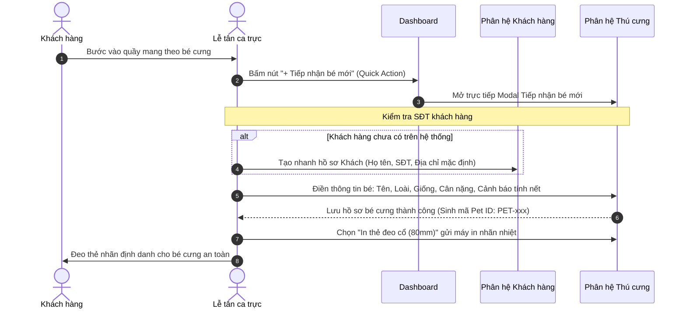
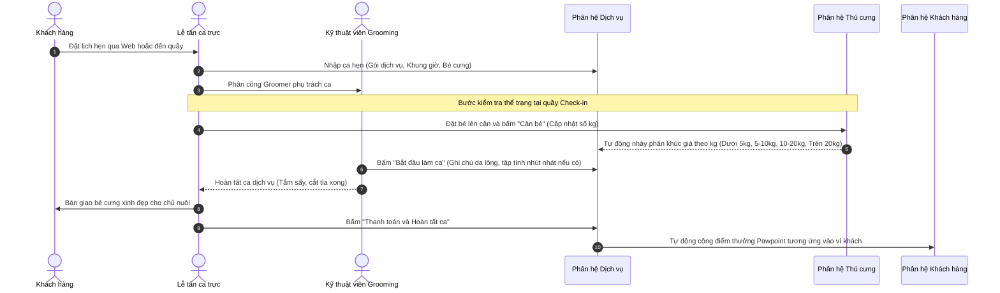
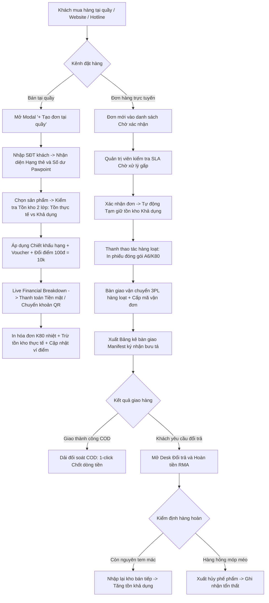
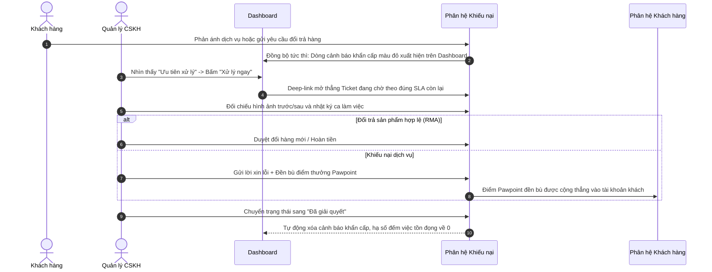
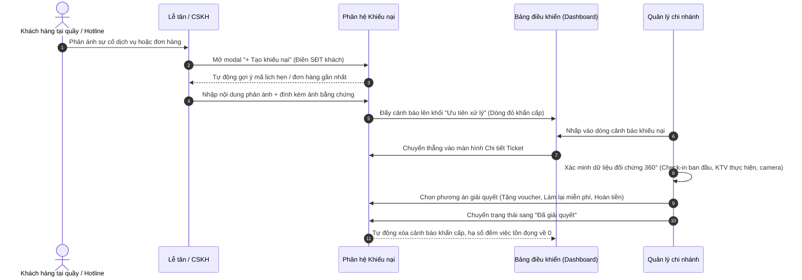
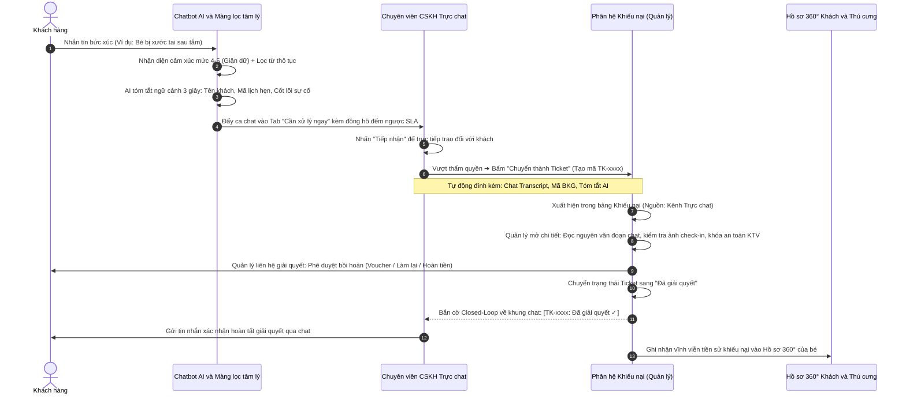
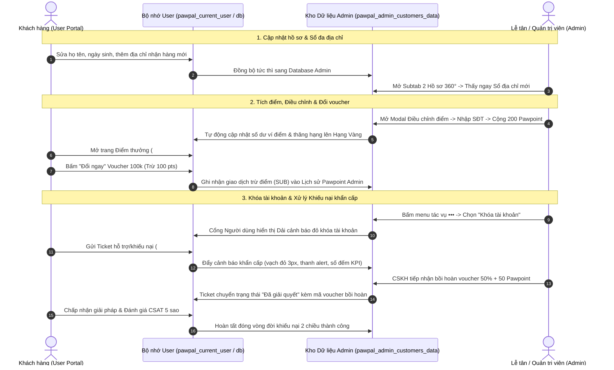

# SỔ TAY VẬN HÀNH VÀ HƯỚNG DẪN LUỒNG NGHIỆP VỤ HỆ THỐNG QUẢN TRỊ PAWPAL-ER

> **Dành cho:** Ban Quản lý cửa hàng, Lễ tân ca trực, Chuyên viên Chăm sóc khách hàng, Kỹ thuật viên Grooming / Spa, Nhân viên Khách sạn thú cưng và Thủ kho Bán lẻ.  
> **Phiên bản:** 2.6 (Chuẩn hóa toàn diện 3 Subtab Phân hệ Khách hàng, Đồng bộ 2 chiều Cổng Người dùng - Admin, Bán hàng và Kho vận, Điều phối Dịch vụ không Thú y và Cơ chế Lưu trữ Trạng thái theo `AGENTS.md`).

---

## MỤC LỤC
1. [Tổng quan hệ sinh thái và Nguyên tắc cốt lõi](#1-tổng-quan-hệ-sinh-thái-và-nguyên-tắc-cốt-lõi)
2. [Sơ đồ luồng nghiệp vụ liên phân hệ (Cross-Module Workflows)](#2-sơ-đồ-luồng-nghiệp-vụ-liên-phân-hệ)
   - [Luồng 1: Tiếp nhận khách hàng và bé cưng mới tại quầy (Walk-in & Chống trùng SĐT)](#luồng-1-tiếp-nhận-khách-hàng-và-bé-cưng-mới-tại-quầy-walk-in)
   - [Luồng 2: Đặt lịch, Đo thể trạng và Thực hiện dịch vụ Spa / Hotel](#luồng-2-đặt-lịch-đo-thể-trạng-và-thực-hiện-dịch-vụ)
   - [Luồng 3: Bán hàng tại quầy (POS), Vận hành Kho 2 lớp và Xử lý Đơn hàng](#luồng-3-bán-hàng-tại-quầy-pos-vận-hành-kho-2-lớp-và-xử-lý-đơn-hàng)
   - [Luồng 4: Tiếp nhận và Xử lý Khiếu nại / Đổi trả theo SLA](#luồng-4-tiếp-nhận-và-xử-lý-khiếu-nại--đổi-trả-theo-sla)
   - [Luồng 5: Tiếp nhận khiếu nại tại quầy hoặc qua Hotline (Ngoại tuyến)](#luồng-5-tiếp-nhận-khiếu-nại-tại-quầy-hoặc-qua-hotline-ngoại-tuyến)
   - [Luồng 6: Luồng tương tác khép kín giữa Trực chat AI và Phân hệ Khiếu nại (Closed-Loop Escalation)](#luồng-6-luồng-tương-tác-khép-kín-giữa-trực-chat-ai-và-phân-hệ-khiếu-nại-closed-loop-escalation)
   - [Luồng 7: Đồng bộ Dữ liệu và Điểm thưởng 2 chiều giữa Cổng Người dùng và Admin (2-Way User-Admin Lifecycle)](#luồng-7-đồng-bộ-dữ-liệu-và-điểm-thưởng-2-chiều-giữa-cổng-người-dùng-và-admin)
3. [Hướng dẫn chi tiết từng phân hệ chức năng](#3-hướng-dẫn-chi-tiết-từng-phân-hệ-chức-năng)
   - [3.1. Phân hệ Tổng quan (Dashboard)](#31-phân-hệ-tổng-quan-dashboard)
   - [3.2. Phân hệ Khách hàng (Customers - Chuẩn 3 Subtabs)](#32-phân-hệ-khách-hàng-customers)
   - [3.3. Phân hệ Thú cưng (Pets)](#33-phân-hệ-thú-cưng-pets)
   - [3.4. Phân hệ Dịch vụ (Services)](#34-phân-hệ-dịch-vụ-services)
   - [3.5. Phân hệ Bán hàng và Kho (Orders)](#35-phân-hệ-bán-hàng-và-kho-orders)
   - [3.6. Phân hệ Nhân sự và Ca làm (Staff)](#36-phân-hệ-nhân-sự-và-ca-làm-staff)
   - [3.7. Phân hệ Khiếu nại và Hỗ trợ (Complaints)](#37-phân-hệ-khiếu-nại-và-hỗ-trợ-complaints)
   - [3.8. Phân hệ Trợ lý ảo Chatbot AI (Chatbot)](#38-phân-hệ-trợ-lý-ảo-chatbot-ai-chatbot)
   - [3.9. Phân hệ Cấu hình hệ thống (Settings)](#39-phân-hệ-cấu-hình-hệ-thống-settings)
4. [Bảng tra cứu nhanh trạng thái và Quy tắc giao diện](#4-bảng-tra-cứu-nhanh-trạng-thái-và-quy-tắc-giao-diện)
5. [Cơ chế lưu và khôi phục trạng thái toàn hệ thống (State Persistence)](#5-cơ-chế-lưu-và-khôi-phục-trạng-thái-toàn-hệ-thống-state-persistence-và-f5reload)

---

## 1. TỔNG QUAN HỆ SINH THÁI VÀ NGUYÊN TẮC CỐT LÕI

### 1.1. Phạm vi dịch vụ của Pawpal
Pawpal là chuỗi tổ hợp **Chăm sóc và Khách sạn Thú cưng Cao cấp (Pet Lifestyle Care và Hospitality)**, bao gồm 4 nhóm dịch vụ cốt lõi:
1. **Dịch vụ Spa và Grooming**: Tắm sấy thư giãn, Vệ sinh tai móng, Nhổ lông tai, Cắt tỉa tạo hình phong cách, Nhuộm lông tai đuôi thảo mộc an toàn.
2. **Khách sạn thú cưng (Pet Hotel)**: Lưu trú phòng Deluxe / Suite máy lạnh, sân chơi vận động, camera giám sát 24/7, chế độ ăn hạt cao cấp hoặc pate tươi theo yêu cầu.
3. **Đưa đón thú cưng tận nhà (Pet Taxi)**: Đón trả thú cưng theo khung giờ yêu cầu bằng lồng vận chuyển chuyên dụng an toàn và tài xế riêng.
4. **Cửa hàng bán lẻ (Pet Shop)**: Thức ăn dinh dưỡng (Pate, Hạt), Phụ kiện thời trang, Sữa tắm chuyên dụng và Đồ chơi tương tác an toàn.

> [!IMPORTANT]
> **ĐỊNH VỊ BẤT BIẾN - TUYỆT ĐỐI KHÔNG CÓ THÚ Y:**  
> Hệ thống Pawpal **hoàn toàn không cung cấp dịch vụ khám chữa bệnh thú y, tiêm thuốc y tế hoặc phẫu thuật lâm sàng**. Toàn bộ giao diện, danh mục, bảng giá và hóa đơn dịch vụ phải sử dụng đúng thuật ngữ chăm sóc thẩm mỹ (Grooming / Spa / Hotel / Taxi). Tuyệt đối cấm sử dụng các từ ngữ "Bác sĩ", "Khám bệnh", "Kê đơn", "Phòng khám thú y", "Bệnh án".

### 1.2. Quy tắc giao diện vàng (`AGENTS.md`)
- **Bo góc cố định 9px**: Áp dụng chuẩn `--admin-radius: 9px;` cho toàn bộ Card, Button, Input, Modal, Popover, Badge.
- **100% Text-Only bên ngoài Sidebar**: Chỉ có thanh menu Sidebar bên trái được hiển thị icon nét mảnh Lucide. Toàn bộ Header Bar, Toolbar, Bảng dữ liệu, Nút bấm và Modal là **100% chữ thuần** (sử dụng text `•••` cho nút tác vụ bảng, nút hành động dạng text pill).
- **Văn phong chuẩn xác**: Tuyệt đối không dùng ký hiệu `&` để thay cho chữ "và" (luôn viết rõ: `Spa và Hotel`, `Hạng và Điểm`, `Sản phẩm và Kho`, `Lưu và Thoát`).
- **Nền kính mờ bán trong suốt (Frosted Glass)**: Các khối thẻ chính dùng `--surface-white: rgba(255, 255, 255, 0.70);` kết hợp `backdrop-filter: blur(10px);`.
- **Triệt tiêu xếp lớp nền (Anti-Opacity Stacking)**: Các thành phần bên trong bảng dữ liệu (`table`, `tbody`, `tr`, `td`) để nền trong suốt.
- **Cảnh báo khẩn cấp**: Thể hiện bằng dòng chữ đỏ thuần tự nhiên (`color: #DC2626; background: transparent; border: none;`), không vẽ khung hộp hay bôi nền đỏ.
- **Viền mép trái (`border-left`)**: Độc quyền duy nhất cho ô đầu tiên của dòng bảng cần Alert (vạch đỏ 3px cho khiếu nại, vạch cam 3px cho lưu ý).
- **Khóa cố định màn hình (Anti-Overscroll)**: Khóa cứng khung màn hình ngoài, triệt tiêu 100% hiện tượng cuộn nảy (Rubber-band bounce).

---

## 2. SƠ ĐỒ LUỒNG NGHIỆP VỤ LIÊN PHÂN HỆ

### Luồng 1: Tiếp nhận khách hàng và bé cưng mới tại quầy (Walk-in)
Dành cho tình huống khách hàng mới lần đầu đưa thú cưng đến cửa hàng.

---

### Luồng 2: Đặt lịch, Đo thể trạng và Thực hiện dịch vụ
Quy trình từ lúc đặt hẹn đến khi bàn giao bé cưng và hoàn tất thanh toán.

---

### Luồng 3: Bán hàng tại quầy (POS), Vận hành Kho 2 lớp và Xử lý Đơn hàng
Quy trình tiếp nhận đơn hàng đa kênh, bán hàng tại quầy thông minh, kiểm soát tồn kho 2 lớp, đóng gói bưu cục hàng loạt, đối soát dòng tiền COD và xử lý đổi trả RMA.

---

### Luồng 4: Tiếp nhận và Xử lý Khiếu nại / Đổi trả theo SLA
Quy trình đảm bảo khách hàng luôn được lắng nghe và xử lý sự cố trong vòng cam kết (SLA), không bao giờ bỏ quên ticket.

---

### Luồng 5: Tiếp nhận khiếu nại tại quầy hoặc qua Hotline (Ngoại tuyến)
Dành cho trường hợp khách hàng phản ánh trực tiếp với thu ngân/lễ tân tại quầy hoặc gọi điện đến hotline.

---

### Luồng 6: Luồng tương tác khép kín giữa Trực chat AI và Phân hệ Khiếu nại (Closed-Loop Escalation)
*Phân định rõ ràng giữa CSKH tuyến đầu (Frontline) và Thẩm định khiếu nại tuyến sau (Back-office).*

#### 1. Ma trận phân tầng xử lý sự cố (Triage Matrix):
- **Cấp độ 1 - Xử lý ngay tại chỗ trên Chat (First-Contact Resolution)**:
  - *Dấu hiệu*: Khách thắc mắc thời gian giao hàng, giao trễ nhẹ, hỏi cách sử dụng sản phẩm, phàn nàn nhẹ về đóng gói.
  - *Hành động*: Chuyên viên CSKH sử dụng mẫu câu gợi ý từ AI để đồng cảm, bấm nút **"Tặng điểm Pawpoint"** (50 - 100 điểm) trực tiếp trong khung chat để tạ lỗi.
  - *Kết quả*: Đóng ca chat thành công, **không tạo ticket khiếu nại** để tránh làm cồng kềnh bộ máy vận hành.
- **Cấp độ 2 - Chuyển giao thành Ticket Khiếu nại chính thức (Escalate to Ticket)**:
  - *Dấu hiệu*: Bé cưng bị trầy xước/chảy máu sau dịch vụ, grooming sai kiểu nghiêm trọng, pet hotel bỏ quên bữa ăn của bé, thất lạc kiện hàng giá trị lớn, khách giận dữ mức độ 4-5 đòi gặp cấp trên hoặc hoàn tiền.
  - *Hành động*: Bắt buộc bấm menu `•••` ➔ **"Chuyển thành Ticket"**. Hệ thống tự động trích xuất biên bản hội thoại (Chat Transcript) và tóm tắt AI sang phân hệ Khiếu nại.

#### 2. Sơ đồ tương tác khép kín 2 chiều:

---

### Luồng 7: Đồng bộ Dữ liệu và Điểm thưởng 2 chiều giữa Cổng Người dùng và Admin (2-Way User-Admin Lifecycle)
*Quy trình đảm bảo tính toàn vẹn dữ liệu thời gian thực giữa Khách hàng cá nhân và Ban Quản trị Pawpal-er.*

---

## 3. HƯỚNG DẪN CHI TIẾT TỪNG PHÂN HỆ CHỨC NĂNG

### 3.1. Phân hệ Tổng quan (Dashboard)
*Trạm chỉ huy 1 điểm chạm – Giám sát toàn bộ hoạt động trong ngày của cửa hàng.*

- **Thanh KPI trên đỉnh**:
  - `Tổng doanh thu hôm nay`: Cộng gộp từ doanh thu bán lẻ phụ kiện và doanh thu dịch vụ Spa/Hotel đã hoàn thành.
  - `Lịch hẹn mới`: Đếm tổng số ca hẹn trong ngày (Bấm vào để nhảy sang Dịch vụ).
  - `Đơn hàng mới`: Tổng số đơn mua sắm phát sinh (Bấm vào để sang Bán hàng).
  - `Khách hàng mới` và `Bé cưng mới`: Số tài khoản và Pet ID được khởi tạo trong ca.
- **Dòng cảnh báo khẩn cấp (Emergency Alert)**:
  - Tự động hiển thị khi có khiếu nại SLA khẩn cấp hoặc sản phẩm hết hàng.
  - Thiết kế thuần chữ đỏ, có nút `Xử lý ngay` để mở thẳng vị trí cần xử lý.
- **Thanh thao tác nhanh tiếp nhận tại quầy (Quick Reception Bar)**:
  - `+ Tiếp nhận bé mới`: Mở ngay form tiếp nhận của phân hệ Thú cưng.
  - `+ Đặt lịch Spa và Hotel`: Mở phiếu tạo lịch hẹn dịch vụ mới.
  - `+ Lên đơn bán lẻ`: Mở giao diện lập đơn bán hàng tại quầy.
- **Khối Ưu tiên xử lý**:
  - Nhấp vào `Khiếu nại chờ xử lý`: Mở tab Khiếu nại và lọc sẵn trạng thái `Chờ xử lý`.
  - Nhấp vào `Đơn hàng chờ duyệt`: Mở tab Bán hàng và lọc sẵn trạng thái `Chờ xác nhận`.
  - Nhấp vào mã `SKU tồn kho sắp hết`: Mở tab Kho và tự động tìm đúng sản phẩm cần nhập thêm.
- **Lịch sắp tới (Calendar / Timeline)**:
  - Cho phép xem theo chế độ `Tháng`, `Tuần`, hoặc `Ngày`.
  - Nhấp vào bất kỳ ca hẹn nào sẽ mở **Modal xem nhanh ca dịch vụ** (hiển thị tên bé, khách hàng, thợ phụ trách, lưu ý kỹ thuật) kèm nút `Chuyển sang ca Dịch vụ`.

---

### 3.2. Phân hệ Khách hàng (Customers - Chuẩn 3 Subtabs)
*Trung tâm Quản trị Dữ liệu Chủ nuôi, Hồ sơ Khách hàng 360°, Sổ Đa địa chỉ, Vận hành Tiếp nhận tại quầy và Hệ sinh thái Tích điểm Pawpoint.*

- **Cấu trúc 3 Subtab chuyên sâu trên Header Bar**:
  1. *Danh sách (`tab-list`)*:
     - **5 Thẻ thống kê KPI nhanh**: Tổng khách hàng, Khách thành viên, Khách vãng lai, Tài khoản bị khóa, Có khiếu nại (hỗ trợ bấm lọc 1 chạm tương tác trực tiếp với bảng dữ liệu).
     - **Dải cảnh báo khiếu nại khẩn cấp (`#custComplaintAlertBar`)**: Tự động nhận diện và hiển thị danh sách các khách hàng đang có Ticket khiếu nại chưa xử lý kèm mã ticket, họ tên và lý do phản ánh. Nhấp vào để lọc ngay bảng dữ liệu.
     - **Thanh công cụ và Bàn tiếp nhận tại quầy (Quick Add Desk)**:
       * *Nút `+ Thêm khách` (`#btnOpenAddCustomerModal`)*: Mở Modal tiếp nhận nhanh khách vãng lai tại quầy.
       * *Tính năng Chống trùng Số điện thoại theo thời gian thực*: Khi lễ tân nhập SĐT từ 9 số trở lên, hệ thống tự động kiểm tra kho dữ liệu. Nếu phát hiện số điện thoại đã tồn tại, hiển thị ngay thông báo cảnh báo đỏ kèm nút **`Xem hồ sơ khách hàng này` (`#btnOpenDupCustomer`)** giúp lễ tân chuyển thẳng sang hồ sơ cũ mà không tạo tài khoản rác.
       * *Nút `Xuất file` (`#btnExportCustomerReport`)*: Xuất toàn bộ danh sách khách hàng ra file CSV mã hóa chuẩn UTF-8 BOM, đảm bảo hiển thị hoàn hảo tiếng Việt có dấu trong Microsoft Excel.
     - **Bảng dữ liệu Khách hàng chuẩn `AGENTS.md`**:
       * *Cột dữ liệu*: Mã KH, Họ tên & Email (liên kết mở hồ sơ), Số điện thoại, Thú cưng đang nuôi (dạng pill xô thơm nhẹ kèm giống loài), Hạng thành viên & Điểm Pawpoint, Cảnh báo, Trạng thái tài khoản, Tác vụ `•••`.
       * *Quy chuẩn viền mép trái (`border-left`)*: Áp dụng độc quyền vạch đỏ 3px (`border-left: 3px solid #DC2626;`) cho khách hàng có khiếu nại và vạch cam 3px (`#D97706;`) cho khách có thú cưng cần lưu ý y tế/tính khí. Ô tiêu đề cột đầu tiên (`th:first-child`) có viền cùng màu nền để căn hàng thẳng tắp.
       * *Tài khoản bị khóa (`.row-locked`)*: Áp dụng `opacity: 0.52;` cho toàn bộ dòng dữ liệu để phân biệt tức thì.
     - **Menu Tác vụ thả xuống Toàn cục (Global Action Dropdown)**:
       * Nút `•••` sử dụng kiến trúc Direct Body Portal (không bao giờ bị che khuất hoặc tràn khung cuộn).
       * Chứa 4 tác vụ chuẩn: `Xem hồ sơ 360°`, `Sửa hồ sơ`, `Điều chỉnh điểm`, `Khóa / Mở khóa tài khoản`.
     - **Thanh Phân trang Căn giữa & Nằm ngoài bảng (`#customerPaginationBar`)**:
       * Nền hoàn toàn trong suốt, không viền khung, căn giữa màn hình.
       * Tiêu chuẩn hiển thị tối đa **10 dòng dữ liệu trên 1 trang**.
       * Sử dụng ký tự điều hướng `<` và `>` (không dùng chữ Trước / Sau).
  2. *Hồ sơ 360° (`tab-profile`)*:
     - **Đường dẫn cấp con (Deep Breadcrumb)**: Tự động cập nhật `/ [Tên khách hàng]` với định dạng chữ nhỏ hơn (13px), màu xanh xô thơm (`#4F7A65`), độ đậm 500 trên Header Bar.
     - **Thanh Thao tác Nhanh Một Chạm (One-Touch Action Bar)**:
       * `Gọi điện`: Kích hoạt giao thức cuộc gọi trực tiếp `tel:[SĐT]`.
       * `Zalo`: Mở cửa sổ chat Zalo trực tiếp với khách `https://zalo.me/[SĐT]`.
       * `Đặt lịch`: Thiết lập sẵn Preset thông tin khách hàng và bé cưng, tự động chuyển sang phân hệ Dịch vụ.
       * `Lên đơn`: Thiết lập sẵn Preset thông tin khách và địa chỉ mặc định, tự động chuyển sang phân hệ Bán hàng.
       * `Khiếu nại`: Thiết lập sẵn Preset thông tin khách, tự động chuyển sang phân hệ Khiếu nại.
     - **Dòng cảnh báo khẩn cấp (Emergency Alert Banner)**: Thuần chữ đỏ `#DC2626` không nền và không viền bao quanh khi khách hàng có sự cố đang xử lý.
     - **5 Tabs Con Chi Tiết Khép Kín**:
       * *Tab 1 - Cá nhân*: Hiển thị thông tin cá nhân, **Sổ đa địa chỉ nhận hàng (Multi-Address Book)** với 1 địa chỉ mặc định (viền xanh `#C3DEC7`, nền `#F4FAF6`) và các địa chỉ phụ (có nút xóa), ô ghi chú nội bộ groomer (lưu trữ độc lập) và nút gửi lại tin nhắn SMS tạo mật khẩu. Modal Chỉnh sửa hồ sơ (`#modalEditCustomer`) hỗ trợ cập nhật họ tên, SĐT, email, giới tính, ngày sinh, hạng thẻ và thêm/sửa/xóa địa chỉ nhận hàng.
       * *Tab 2 - Thú cưng*: Danh sách các bé cưng thuộc sở hữu của khách hàng. Mỗi thẻ bé cưng có nút **`Xem hồ sơ bé`** (chuyển sang phân hệ Thú cưng), nút **`Sửa`** và nút **`Xóa`** (kèm Modal Sửa thông tin bé `#modalEditPet` và Modal Thêm bé mới `#modalAddPet`).
       * *Tab 3 - Đơn hàng*: Danh sách lịch sử đơn hàng bán lẻ tự động đồng bộ từ phân hệ Bán hàng, nút xem chi tiết đơn hàng và huy hiệu số đếm màu đỏ (`.tab-badge-count`) khi có đơn đang xử lý.
       * *Tab 4 - Lịch hẹn*: Lịch sử các ca dịch vụ Spa/Hotel kèm KTV thực hiện, nút xem nhật ký quy trình chăm sóc và huy hiệu số đếm màu đỏ khi có lịch hẹn chưa hoàn tất.
       * *Tab 5 - Khiếu nại*: Danh sách các phản ánh sự cố dịch vụ hoặc đơn hàng kèm mức độ ưu tiên, nút **`Mở Ticket xử lý`** chuyển thẳng sang phân hệ Khiếu nại và huy hiệu số đếm màu đỏ khi có sự cố đang chờ giải quyết.
  3. *Pawpoint (`tab-pawpoint`)*:
     - **Bảng Quy chế 4 Cấp bậc Thành viên**: Thể hiện chi tiết điều kiện chi tiêu, tỷ lệ tích điểm và quyền lợi đặc quyền của 4 hạng (*Đồng, Bạc, Vàng, Kim Cương*).
     - **Bảng Lịch sử Biến động Pawpoint Toàn Hệ Thống**:
       * Ghi nhận đầy đủ: Mã giao dịch (`PWH-xxx`), Thời gian, Mã và Tên khách hàng, Số điện thoại, Loại biến động (Cộng điểm `ADD` / Trừ điểm `SUB`), Số điểm thay đổi, Số dư sau giao dịch, Lý do phát sinh.
       * Bộ lọc loại giao dịch nhanh (`Tất cả`, `Cộng điểm`, `Trừ điểm`), thanh tìm kiếm thời gian thực và nút xuất file báo cáo CSV UTF-8 BOM.
     - **Modal Điều chỉnh Pawpoint Thủ công (`#modalAdjustPoints`)**:
       * Hỗ trợ lễ tân/CSKH thực hiện cộng hoặc trừ điểm cho khách hàng.
       * *Gợi ý khách hàng thời gian thực (`#adjustPhoneCustomerHint`)*: Khi nhập số điện thoại, hệ thống tự động tìm và hiển thị ngay tên khách, hạng thẻ hiện tại và số dư điểm khả dụng.
       * *5 Lý do điều chỉnh chuẩn nghiệp vụ*: Tích điểm ca dịch vụ tại quầy, Bồi hoàn sự cố CSKH, Thưởng chương trình tri ân sinh nhật, Thu hồi điểm do hủy dịch vụ / hoàn tiền, Điều chỉnh sai sót kỹ thuật.
       * *Tự động Đánh giá và Thăng hạng Thành viên*: Khi cộng điểm làm số dư vượt ngưỡng (Bạc 500 pts, Vàng 2.000 pts, Kim Cương 5.000 pts), hệ thống tự động nâng hạng thẻ tương ứng.
       * *Đồng bộ 2 chiều tức thì*: Cập nhật đồng thời vào Database Khách hàng Admin, Lịch sử Pawpoint và ví điểm của Người dùng trên Cổng cá nhân (`pawpal_current_user`).

---

### 3.3. Phân hệ Thú cưng (Pets)
*Quản trị danh tính, thể trạng và tập tính của từng bé cưng.*

- **Mã định danh bé cưng (Pet ID)**: Mỗi bé cưng có 1 mã duy nhất (`PET-001`, `PET-002`...).
- **Cân bé và Ma trận phân khúc giá**:
  - Nhấp nút `Cân bé` trên menu tác vụ `•••` hoặc trong hồ sơ để nhập cân nặng mới.
  - Hệ thống tự động tính phân khúc giá dịch vụ Spa/Grooming và Hotel tương ứng:
    * *Dưới 5 kg*: Spa 180.000đ • Hotel 200.000đ/ngày.
    * *5 - 10 kg*: Spa 250.000đ • Hotel 300.000đ/ngày.
    * *10 - 20 kg*: Spa 350.000đ • Hotel 400.000đ/ngày.
    * *Trên 20 kg*: Spa 500.000đ • Hotel 550.000đ/ngày.
- **In thẻ đeo cổ (80mm)**:
  - Lệnh in nhãn nhiệt quầy tiếp nhận: Mã bé, Tên bé, Tên chủ nuôi, SĐT khẩn cấp và cảnh báo tập tính (ví dụ: *Dữ khi sấy chân sau*).
- **Lưu trữ và Khôi phục hồ sơ**:
  - Bé cưng đã chuyển chủ hoặc không còn sử dụng dịch vụ có thể đưa vào trạng thái `Lưu trữ`. Khi khách đưa bé trở lại có thể bấm `Khôi phục hồ sơ`.

---

### 3.4. Phân hệ Dịch vụ (Services)
*Điều phối lịch hẹn Spa và Grooming, Khách sạn thú cưng Pet Hotel 24/7 và đưa đón Pet Taxi tận nơi.*

- **Cấu trúc 4 Subtab chuyên sâu trên Header Bar**:
  1. *Lịch hẹn (`tab-service-bookings`)*:
     - **6 Thẻ thống kê KPI nhanh**: Tổng lịch hôm nay, Chờ xác nhận, Sắp tới trong 60 phút, Đang thực hiện, Hoàn thành, Yêu cầu đổi và Hủy.
     - **Thanh cảnh báo lịch hẹn sắp tới trong 60 phút (`#upcomingAlertBar`)**: Tự động lọc và hiển thị danh sách các ca chuẩn bị diễn ra giúp KTV chủ động đón bé.
     - **Bảng dữ liệu điều phối đa dịch vụ**:
       * *Pet Hotel*: Hiển thị khoảng thời gian lưu trú (`01/07 ➔ 04/07`), badge số đêm (`3 đêm`), hạng phòng (`DLX-04`) và khẩu phần dinh dưỡng.
       * *Pet Taxi*: Hiển thị lộ trình đưa đón (`45 Lê Duẩn ➔ Q.1`), khoảng cách km, loại chuyến (`2 chiều khứ hồi`) và tài xế chuyên trách.
       * *Spa và Grooming*: Hiển thị yêu cầu tạo hình (`Mặt tròn Boo`), cấp độ thợ (`Senior / Master Groomer`) và vạch đỏ cảnh báo an toàn da lông / tính khí.
     - **Modal Tạo lịch hẹn tại quầy / Hotline (`#modalCreateBooking`)**: Tự động chuyển đổi các trường nhập liệu tương ứng theo phân nhóm (Hotel / Taxi / Spa).
  2. *Hồ sơ ca 360° (`tab-service-detail`)*:
     - **Thanh tiêu đề và Nút thao tác một chạm**: Xác nhận lịch, Tiếp nhận bé, Hoàn thành dịch vụ, Đổi KTV, Tạo khiếu nại.
     - **Dòng cảnh báo an toàn thú cưng (Safety Alert Banner)**: Thuần chữ đỏ cảnh báo dị ứng hương liệu, vết thương cũ hoặc tính khí nhút nhát/dữ dằn.
     - **Khối thông tin đặc thù theo dịch vụ (`#detailSpecialServiceFields`)**: Thể hiện đầy đủ phòng chuồng & camera IP (Hotel), lộ trình & SĐT tài xế (Taxi), kiểu dáng tạo hình (Spa).
     - **Biên bản tiếp nhận an toàn Zero-Claim (`#detailIntakeSafetySection`)**: Đối chiếu cân nặng thực tế tại quầy, checklist 4 vùng ngoại quan (Da lông, Mắt mũi tai, Vết xước cũ, Tính khí), tư trang gửi lại và ảnh bằng chứng tiếp nhận.
     - **Bảng kê chi phí 2 tầng Add-ons & Dịch vụ đi cùng (`#detailCostBase`, `#detailAccompanyingServicesList`, `#detailSurchargeBreakdownList`)**:
       * *Tầng 1 (Pre-booked Web Add-ons / Dịch vụ đi cùng)*: Gói dịch vụ ghép thêm do khách chọn trước.
       * *Tầng 2 (On-site Surcharges Desk)*: Phụ phí phát sinh tại quầy có ghi nhận lý do, hình ảnh bằng chứng và phương thức xác nhận với khách hàng (Zalo / Gọi điện / Trực tiếp).
     - **Nhật ký chăm sóc thời gian thực (Care-Log Timeline)**: KTV cập nhật tiến trình từng bước, đính kèm ảnh thực tế, nút chia sẻ liên kết công khai cho chủ nuôi và Photo Lightbox xem ảnh to.
  3. *Danh mục và Bảng giá (`tab-service-catalog`)*:
     - Quản lý danh mục 3 phân nhóm: Spa và Grooming, Pet Hotel, Pet Taxi.
     - Ma trận bảng giá theo 4 phân khúc cân nặng (<5kg, 5-10kg, 10-20kg, >20kg).
     - Cấu hình quy trình kỹ thuật chuẩn SOP (SOP Spa trọn gói 7 bước, Cắt tỉa tạo kiểu 6 bước, Hotel 6 bước/ngày, Taxi 4 bước).
  4. *Đánh giá và Phản hồi (`tab-service-reviews`)*:
     - **4 Thẻ KPI đánh giá**: Điểm trung bình toàn chi nhánh, Tổng lượt đánh giá, Chưa phản hồi, Cảnh báo (1-3 sao).
     - **Modal Phản hồi đánh giá chuyên nghiệp (`#modalReplyReview`)**: Cung cấp các mẫu câu trả lời lịch sự theo từng mức sao, tùy chọn gửi kèm Voucher đền bù (50k, 100k, lượt tắm miễn phí).
     - **Chuyển giao 1-chạm thành Phiếu khiếu nại CSKH (`#btnEscalateToComplaint`)**: Tự động trích xuất thông tin sang phân hệ Khiếu nại khi khách hàng không hài lòng.

- **Cơ chế Tích lũy điểm thưởng PawPoint tự động**:
  - Khi hoàn tất ca dịch vụ tại quầy (`#formCompleteBooking`), hệ thống tự động quy đổi `10.000 đ = 1 Pawpoint` dựa trên tổng tiền thanh toán thực tế và cộng thẳng vào ví điểm của khách hàng trong hệ thống CRM.
  - Hỗ trợ đổi điểm Pawpoint trừ trực tiếp vào hóa đơn thanh toán dịch vụ (*100 điểm = 10.000 đ*).

---

### 3.5. Phân hệ Bán hàng và Kho (Orders)
*Quản lý vòng đời đơn hàng đa kênh, trung tâm xử lý RMA đổi trả, đối soát dòng tiền COD bưu cục, quản trị tồn kho 2 lớp và lập đơn POS tại quầy.*

- **Cấu trúc 4 Subtab chuyên sâu trên Header Bar**:
  1. *Đơn hàng (`tab-order-list`)*:
     - **6 Thẻ thống kê KPI nhanh**: Tổng đơn hôm nay, Chờ xác nhận, Đang chuẩn bị, Đang giao hàng, Đã hoàn tất, Đổi trả và Hủy.
     - **Thanh thao tác hàng loạt (Batch Actions Toolbar)**:
       * *In hàng loạt phiếu đóng gói (`#modalPackingSlip`)*: Xem trước khổ in A6 / K80 nhiệt liên tiếp, tự động gom danh sách mặt hàng cho kho nhặt đồ.
       * *Bàn giao vận chuyển hàng loạt (`#modalBatchDispatch`)*: Chỉ định bưu cục tiếp nhận (*J và T Express, GHTK, Viettel Post, Đội giao PawPal*), tự động cấp dải mã vận đơn chuẩn.
       * *Xuất bảng kê bàn giao (`#modalDispatchManifest`)*: Xuất biên bản ký nhận bưu tá kèm tổng số kiện và số tiền thu hộ COD.
     - **Bộ lọc SLA Quá hạn và Cảnh báo nhanh**:
       * *Có khiếu nại*: Lọc nhanh các đơn có yêu cầu đổi trả RMA hoặc khiếu nại chất lượng.
       * *Chờ xử lý gấp*: Lọc các đơn mới đặt cần xác nhận ngay.
       * *Quá hạn SLA (>30p)*: Cảnh báo đơn chờ duyệt quá thời gian cam kết.
     - **Dải đối soát dòng tiền COD bưu cục (`#codReconcileSummaryStrip`)**:
       * Tự động hiển thị khi có đơn giao thành công nhưng tiền thu hộ COD đang chờ bưu cục chuyển về tài khoản (`cod_pending`).
       * Nút `Xác nhận đối soát toàn bộ` 1-chạm giúp kế toán chốt sổ dòng tiền COD tức thì.
  2. *Hồ sơ đơn (`tab-order-detail`)*:
     - **Thẻ Hồ sơ Đổi trả và Hoàn tiền (RMA)**: Hiển thị ngay đầu trang khi đơn có phát sinh khiếu nại (*Mã RMA, phương án giải quyết, lý do, kết quả kiểm định kho, số tiền bồi hoàn*) kèm nút điều hướng trực tiếp sang phân hệ Khiếu nại.
     - **Bảng danh sách sản phẩm và Bảng kê tài chính chi tiết**: Thể hiện tiền hàng tạm tính, phí vận chuyển, chiết khấu voucher, giảm trừ điểm Pawpoint và tổng thanh toán.
     - **Thông tin giao nhận và Đơn vị vận chuyển**: Tên người nhận (liên kết mở hồ sơ khách), SĐT, địa chỉ, phương thức thanh toán, hãng giao nhận, mã vận đơn bưu cục và lịch trình Timeline thời gian thực.
     - **Nút thao tác một chạm theo trạng thái**: In phiếu đóng gói, Bàn giao vận chuyển, Xác nhận thu tiền, Đối soát tiền COD, Tạo khiếu nại và Đổi trả (`#modalReturnRefund`), Hoàn tất đơn hàng.
  3. *Sản phẩm và Kho (`tab-order-products`)*:
     - **4 Thẻ chỉ số kho hàng**: Tổng mặt hàng, Đang còn hàng, Sắp hết hàng, Tạm ngưng bán.
     - **Cơ chế Tồn kho 2 lớp (2-Layer Inventory)**:
       * *Tổng tồn*: Số lượng vật lý thực tế trong kho.
       * *Tạm giữ*: Số lượng tự động khóa cho các đơn đang chờ xử lý / đóng gói (`pending`, `confirmed`) để triệt tiêu hiện tượng bán vượt tồn (*Overselling*).
       * *Khả dụng*: Số lượng thực tế sẵn sàng để bán (`Khả dụng = Tổng tồn - Tạm giữ`).
     - **Cảnh báo ngưỡng an toàn (Min Stock Alert)**:
       * `An toàn (Min+)`: Số khả dụng trên mức an toàn (*Muted Pastel xanh*).
       * `Sắp hết (<=Min)`: Số khả dụng chạm hoặc dưới ngưỡng tối thiểu (*Muted Pastel hổ phách*).
       * `Hết hàng`: Số khả dụng bằng 0 (*Muted Pastel đỏ đất*).
     - **Modal Điều chỉnh Tồn kho (`#modalAdjustStock`)**: Hỗ trợ thao tác Nhập thêm `+`, Xuất hủy `-`, Kiểm kê đặt lại `=`, cập nhật giá niêm yết mới và trạng thái kinh doanh.
     - **Modal Thêm sản phẩm mới (`#modalAddProduct`)**: Thiết lập mã SKU, danh mục, giá bán lẻ, tồn ban đầu và ngưỡng cảnh báo tối thiểu.
  4. *Khuyến mãi (`tab-order-promos`)*:
     - **3 Thẻ KPI khuyến mãi**: Voucher đang chạy, Lượt đã dùng hôm nay, Voucher sắp hết hạn.
     - **Bảng quản trị Voucher**: Quản lý mã voucher, mức giảm giá, đơn hàng tối thiểu, điểm Pawpoint cần đổi, thời hạn áp dụng, lượt đã dùng và trạng thái phát hành.
     - **Modal Tạo mã khuyến mãi (`#modalCreateVoucher`) và Quản lý / Gia hạn Voucher (`#modalVoucherAction`)**.
- **Quy trình Lập đơn POS tại quầy thông minh (`#modalCreateOrder`)**:
  - **Tra cứu khách hàng tự động**: Nhập số điện thoại khách hàng, hệ thống tự động nhận diện và hiển thị Banner Thành viên (*Hạng thẻ Kim Cương / Vàng / Bạc / Đồng và Số dư điểm Pawpoint*).
  - **Áp dụng chiết khấu tự động**: Chiết khấu hạng thành viên (*Kim Cương 10%, Vàng 5%, Bạc 3%*), áp dụng mã giảm giá Voucher hợp lệ và quy đổi trừ điểm Pawpoint (*100 điểm = 10.000 đ*).
  - **Bảng kê tính tiền thời gian thực (Live Financial Breakdown)**: Cập nhật tức thời từng dòng giảm trừ và tổng tiền cần thanh toán.
  - **Đồng bộ kho và ví điểm**: Tự động trừ tồn kho thực tế, trừ số dư ví điểm khách hàng, tăng lượt sử dụng voucher và mở màn hình xem đơn hàng.

---

### 3.6. Phân hệ Nhân sự và Ca làm (Staff)
*Quản lý danh sách nhân viên, xếp lịch ca trực, phân quyền nghiệp vụ và theo dõi đánh giá CSAT.*

- **Cấu trúc 4 Subtab chuyên sâu trên Header Bar**:
  1. *Danh sách nhân sự (`tab-staff-list`)*:
     - 4 Thẻ KPI nhân sự: Tổng nhân sự, Đang làm việc, Nghỉ phép / Tạm nghỉ, Đánh giá CSAT trung bình toàn chi nhánh.
     - Bộ lọc vai trò: Lễ tân ca trực, Kỹ thuật viên Grooming / Spa, Chăm sóc Khách sạn Pet Hotel, Tài xế Pet Taxi, Quản lý chi nhánh.
     - Bảng danh sách: Mã NV, Họ tên, Chức vụ, Số điện thoại, Ca làm việc hôm nay, Điểm CSAT, Trạng thái hoạt động.
  2. *Hồ sơ nhân sự 360° (`tab-staff-profile`)*:
     - Thông tin cá nhân, hợp đồng lao động, chứng chỉ nghề nghiệp Grooming quốc tế.
     - Lịch sử ca làm việc, tổng số ca hoàn thành và nhật ký ghi nhận khen thưởng / nhắc nhở.
  3. *Lịch phân ca trực (`tab-staff-schedule`)*:
     - Bảng lịch phân ca theo Tuần và Ngày:
       * *Ca sáng*: 08:00 - 16:00 (Lễ tân, Groomer tắm sấy, Pet Taxi).
       * *Ca chiều*: 13:00 - 21:00 (Groomer cắt tỉa tạo hình, Lễ tân chốt ca).
       * *Ca trực đêm Pet Hotel*: 20:00 - 08:00 sáng hôm sau (Giám sát phòng lưu trú, camera an ninh 24/7, cho ăn đêm).
     - Điều phối và đổi ca trực linh hoạt giữa các nhân sự cùng chuyên môn.
  4. *Đánh giá CSAT và Hiệu suất KPI (`tab-staff-assessment`)*:
     - Thống kê tỷ lệ hài lòng của khách hàng (CSAT 1-5 sao) theo từng nhân sự.
     - Đánh giá năng suất: Số thú cưng đã chăm sóc, số đơn bán lẻ phụ kiện đã lập, thời gian hoàn thành ca trung bình.

---

### 3.7. Phân hệ Khiếu nại và Hỗ trợ (Complaints)
*Giải quyết sự cố dịch vụ và đổi trả hàng minh bạch, bảo vệ uy tín thương hiệu.*

- **Cấu trúc 3 Subtab chuyên sâu trên Header Bar**:
  1. *Theo Dịch vụ (`tab-complaint-services`)*: Quản lý các sự cố về Spa và Grooming, Pet Hotel, Pet Taxi (kèm nhãn mức độ, KTV thực hiện, đồng hồ đếm ngược SLA).
  2. *Theo Đơn hàng (`tab-complaint-orders`)*: Quản lý khiếu nại về hàng lỗi, giao trễ, giao sai màu/kích thước, quy trình đổi trả hàng RMA.
  3. *Chi tiết khiếu nại (`tab-complaint-detail`)*: Màn hình thẩm định và giải quyết 360°.
- **Dữ liệu đối chứng 360° (Cross-Check Data)**:
  - *Dành cho Dịch vụ*: Đối chiếu tình trạng sức khỏe lúc check-in đón bé, hình ảnh chụp vành tai/da lông đầu vào, nhật ký chăm sóc của KTV. Có nút *"Tạm khóa an toàn KTV"* để đình chỉ tạm thời KTV có nguy cơ vi phạm quy chuẩn.
  - *Dành cho Đơn hàng*: Đối chiếu hình ảnh kiểm hàng trước khi đóng gói tại kho, thông tin đơn vị vận chuyển (GHN/GHTK), mã vận đơn và chữ ký người nhận.
  - *Nguồn từ Trực chat*: Tự động hiển thị khối **"Biên bản đối thoại từ Kênh Trực chat"** trích xuất nguyên văn trao đổi giữa khách và CSKH.
- **4 Phương án giải quyết và Đền bù chính thức**:
  1. *Tặng Voucher và Pawpoint bồi hoàn*: Cộng trực tiếp điểm thưởng vào tài khoản khách và cấp mã voucher giảm giá cho lần chăm sóc kế tiếp.
  2. *Làm lại dịch vụ miễn phí (Redo Service)*: Lên lịch hẹn mới miễn phí 100%, chỉ định KTV trưởng hoặc Groomer tay nghề cao thực hiện.
  3. *Hoàn tiền bồi thường*: Nhập số tiền hoàn và chọn phương thức chuyển khoản/tiền mặt.
  4. *Quy trình đổi trả hàng chuẩn RMA (4 bước)*: Tiếp nhận yêu cầu ➔ Bưu tá thu hồi hàng ➔ Kho kiểm định chất lượng ➔ Xuất hàng đổi mới hoặc hoàn tiền.
- **Đồng hồ đếm ngược SLA**:
  - Mức độ Khẩn cấp (High / Urgent): Cảnh báo đỏ, ưu tiên xử lý trong 30 phút - 2 giờ.
  - Mức độ Tiêu chuẩn (Normal): Giải quyết dứt điểm trong vòng 24 giờ.

---

### 3.8. Phân hệ Trợ lý ảo Chatbot AI và Trực chat CSKH (Chatbot)
*Trung tâm Tiếp nhận và Điều phối CSKH thông minh kết hợp Gemini AI và Nhân viên trực tuyến.*

- **Bố cục Hộp thư 3 khu vực chuẩn quốc tế**:
  1. *Cột 1 (Trái) - Danh sách hội thoại và Bộ lọc thông minh*:
     - Tab **"Xử lý ngay"**: Chỉ hiển thị các ca chat khẩn cấp (khách bực bội cấp 4-5, sự cố thú cưng, quá hạn SLA) kèm số đếm màu đỏ.
     - Tab **"Đang chat"**: Danh sách các ca nhân viên đã bấm "Tiếp nhận" và đang trực tiếp gõ phím.
     - Tab **"Tất cả"**: Toàn bộ lịch sử ca chat của Bot và các ca đã hoàn tất.
  2. *Cột 2 (Giữa) - Khung chat trực tiếp và Điều phối nghiệp vụ*:
     - **Thẻ tóm tắt ngữ cảnh AI 3 giây**: Tự động nhận diện tên khách, số điện thoại, vấn đề cốt lõi, mã đơn/lịch hẹn và đề xuất hướng xử lý.
     - **Màng lọc bảo vệ tâm lý nhân viên**: Tự động che mờ các từ ngữ thô tục, lăng mạ thành thông báo an toàn, giúp nhân viên giữ vững bình tĩnh.
     - **Gợi ý AI và Thư viện câu mẫu**: Trợ lý AI gợi ý sẵn câu trả lời đồng cảm/xoa dịu theo ngữ cảnh, bấm "Dùng mẫu này" để đưa ngay vào ô soạn thảo.
     - **Nút 3 chấm `•••` Tác vụ một chạm**:
       * *Tặng điểm Pawpoint*: Nạp ngay 50 - 100 điểm tạ lỗi trực tiếp vào ví khách hàng.
       * *Chuyển thành Ticket*: Trích xuất toàn bộ biên bản đoạn chat chuyển sang phân hệ Khiếu nại.
       * *Chuyển cấp Quản lý*: Bàn giao ca chat cho cấp quản lý can thiệp khi khách quá căng thẳng.
  3. *Cột 3 (Phải) - Bảng thông tin khách hàng 360°*:
     - Xem ngay họ tên, số điện thoại, hạng thành viên, số dư điểm Pawpoint.
     - Danh sách thú cưng của khách và cảnh báo dị ứng/tập tính.
     - Đơn hàng gần nhất và Lịch hẹn gần nhất (có liên kết nhảy nhanh).
     - **Danh sách khiếu nại đang mở**: Tự động hiển thị trạng thái giải quyết khép kín từ phân hệ Khiếu nại (`Đã giải quyết ✓`).
     - Khung ghi chú nội bộ bí mật dành cho nhân viên ca trực.

---

### 3.9. Phân hệ Cấu hình hệ thống (Settings và System Configuration)
*Trung tâm Thiết lập và Đồng bộ Nguồn Dữ liệu Duy nhất (Single Source of Truth - SSOT) cho toàn bộ hệ sinh thái PawPal (Admin POS, User Portal, Web Store, Service Booking).*

- **Cấu trúc 4 Subtab chuyên sâu trên Header Bar (Chuẩn `AGENTS.md`)**:
  1. *Banner và Khuyến mãi (`tab-banner-promos`)*:
     - **Thanh cảnh báo Zero Miss Strip**: Tự động quét và cảnh báo các Voucher sắp cạn quota ($\le 10$ lượt) hoặc hết sạch lượt ($0$ lượt), các Banner sắp hết hạn trong vòng 24 - 48 giờ để không đứt gãy luồng tương tác khách hàng.
     - **Quản lý Banner**: Danh sách Banner hiển thị ngoài trang chủ và trang dịch vụ, hỗ trợ thao tác 1 chạm gia hạn 30 ngày (`btn-extend-banner`), bật/tắt hiển thị.
     - **Bảng Master Voucher Khuyến mãi**: Lọc theo phân hệ (Shop, Spa, Hotel, System), hiển thị tiến độ hạn ngạch phát hành (ví dụ: `86/200`, `96/100`), menu tác vụ 3 chấm text-only `•••` (Gia hạn thêm 50 lượt, Đổi trạng thái Bật/Tắt, Xóa voucher).
     - **Cấu hình Quy chế Điểm thưởng PawPoints**: Tỷ lệ tích điểm (*10.000 VNĐ = 1 điểm*), tỷ lệ quy đổi (*1 điểm = 100 VNĐ*), thưởng đăng ký mới (+50 điểm), thưởng đơn đầu (+100 điểm), thưởng sinh nhật (+200 điểm).
     - **Thông báo Website**: Quản lý dải băng thông báo Top-bar và Popup thông báo khẩn cấp cho khách hàng.
  2. *Quản lý Nội dung Website (`tab-content-management`)*:
     - **5 Thẻ KPI Thống kê Nội dung**: Tổng bài viết, Đã công khai, Bản nháp, Tạm ẩn, Tổng lượt xem tháng.
     - **Bảng Quản lý Blog và Cẩm nang**: Lọc theo danh mục (Chó, Mèo, Dinh dưỡng, Grooming, Mẹo chăm sóc) và trạng thái (Công khai, Bản nháp, Tạm ẩn).
     - **Cơ chế Nạp Tri thức AI RAG (Retrieval-Augmented Generation)**: Mỗi bài viết cẩm nang được tự động trích xuất các từ khóa cốt lõi (Entities & Keywords) và nội dung tóm lược chuẩn mực để nạp trực tiếp vào Prompt Context của Trợ lý ảo Chatbot AI PawPal, giúp Chatbot luôn tư vấn đúng kiến thức chuẩn chuyên gia.
  3. *Cấu hình Hệ thống (`tab-system-config`)*:
     - **Card 1: Thông tin Cửa hàng và Chi nhánh (Store Profile)**: Tên thương hiệu, Tên công ty pháp lý, Hotline tiếp nhận 24/7 (`1900 888 999`), Số khẩn cấp, Email CSKH (`cskh@pawpal.vn`), Mã số thuế VAT (`0316889988`), Địa chỉ trụ sở cơ sở và liên kết mạng xã hội (Zalo OA, Facebook).
     - **Card 2: Phương thức Thanh toán**: Quản lý bật/tắt 4 cổng thanh toán độc lập (COD, Chuyển khoản QR Banking Vietcombank, Ví điện tử MoMo, Cổng thanh toán VNPay) và thông tin tài khoản thụ hưởng.
     - **Card 3: Đơn vị Vận chuyển và Biểu phí**: Mức đơn miễn phí giao hàng (*Đơn từ 300.000 VNĐ*), Biểu phí giao hàng nội thành (*25.000 VNĐ*), ngoại tỉnh (*35.000 VNĐ*), giao hỏa tốc 2 giờ (*45.000 VNĐ*), và thông số kết nối API đối tác 3PL (GHN, GHTK, GrabExpress).
     - **Card 4: Chính sách Đặt lịch, Giờ mở cửa và Pet Hotel**: Khung giờ phục vụ chi nhánh (*08:00 - 20:00 ngày thường, đến 21:00 cuối tuần*), Quy định Pet Hotel (*Check-in sau 14:00, Check-out trước 12:00, Phụ phí trả trễ 100.000 VNĐ / nửa ngày*), Công suất tối đa (*4 bé / ca*), Quy tắc hủy miễn phí (*trước 4 giờ, phí trễ 50.000 VNĐ*).
     - **Card 5: Kết nối Đối tác API và Live Healthcheck**: Đo ping thời gian thực tới hạ tầng GHN Express, MoMo Merchant Gateway, VNPay Payment Engine.
  4. *Nhật ký Cấu hình (`tab-audit-logs`)*:
     - **4 Thẻ KPI Nhật ký**: Tổng lượt thay đổi, Đã đồng bộ SSOT, Phân hệ tác động gần nhất, Trạng thái Khóa an toàn.
     - **Bảng Master Nhật ký Thay đổi**: Lọc theo từ khóa, phân hệ tác động (Khách hàng, Dịch vụ, Bán hàng, Nhân sự, Cửa hàng), ghi nhận thời gian chi tiết, người thực hiện, nội dung thay đổi và trạng thái `Đã đồng bộ SSOT`.

- **Cơ chế Khóa an toàn (Safe Mode) và Xác nhận Tác động Đa phân hệ (SSOT Impact Confirmation)**:
  - **Khóa an toàn chống thao tác nhầm**: Mặc định hệ thống luôn ở trạng thái **`Khóa an toàn: Đang bật`** để bảo vệ toàn bộ tham số vận hành lõi. Quản trị viên phải bấm *"Mở khóa để sửa"* trước khi lưu bất kỳ thay đổi nào.
  - **Modal Cảnh báo Tác động Đa phân hệ (Impact Modal)**: Khi lưu thay đổi (Thanh toán, Giao hàng, Đặt lịch, Cửa hàng), hệ thống tự động mở modal cảnh báo trực quan liệt kê chính xác các phân hệ con chịu ảnh hưởng tức thì (ví dụ: User Portal, Shop Checkout, Lịch hẹn Dịch vụ, Hóa đơn VAT) trước khi bấm *"Xác nhận và Đồng bộ ngay"*.
  - **Nhật ký Thay đổi Cấu hình (Audit Trail SSOT)**: Tự động ghi nhận thời gian chi tiết, người thực hiện, phân hệ tác động và nội dung điều chỉnh kèm nhãn `Đã đồng bộ SSOT`.

- **Cơ chế Phân biệt Trạng thái Tài khoản Người dùng (User Deactivation vs Admin Lock)**:
  - **Khách hàng tự tạm dừng (`status: 'DEACTIVATED'`)**: Người dùng tự thao tác tạm dừng tài khoản trong User Portal Settings (`#btnDeactivateAccount`). Trạng thái này cho phép khách tự đăng nhập lại bất kỳ lúc nào để tái kích hoạt.
  - **Admin khóa tài khoản (`status: 'LOCKED'`)**: Quản trị viên chủ động vô hiệu hóa tài khoản vi phạm trong Admin Customers Module. Dòng khách hàng trong bảng quản trị bị làm mờ `opacity: 0.52` và khách không thể tự mở khóa trừ khi Admin phê duyệt.

---

## 4. BẢNG TRA CỨU NHANH TRẠNG THÁI VÀ QUY TẮC GIAO DIỆN

| Nhóm trạng thái | Gam màu chuẩn (`AGENTS.md`) | Màu nền | Màu chữ | Ví dụ hiển thị |
| :--- | :--- | :--- | :--- | :--- |
| **Tích cực / Hoàn thành** | Muted Forest Green | `#DCEEE2` | `#165335` | `Đang hoạt động`, `Đã xác nhận`, `Đã hoàn tất`, `Đã thanh toán`, `Còn hàng` |
| **Chờ duyệt / Lưu ý** | Warm Amber (Hổ phách dịu) | `#F5E8D3` | `#734718` | `Chờ xác nhận`, `Chờ xử lý`, `Đang chuẩn bị`, `Sắp hết hàng`, `Tạm dừng` |
| **Khẩn cấp / Tiêu cực** | Muted Earth Red (Đỏ đất) | `#F7DCDC` | `#8F2424` | `Đã hủy`, `Bị khóa`, `Hết hàng`, `Khiếu nại khẩn` |
| **Tiến trình / Thông tin** | Muted Soft Blue (Xanh phấn) | `#DCEAF2` | `#20495E` | `Đang thực hiện`, `Đang giao hàng`, `Đang lưu trú Hotel` |
| **Trung tính / Mặc định** | Muted Sage Slate (Xám xô thơm)| `#E2ECE5` | `#2D483B` | `Bản nháp`, `Lưu trữ`, `Sắp tới` |

### Quy tắc cảnh báo viền mép trái (`border-left`)
- **Độc quyền duy nhất cho dòng dữ liệu bảng cần Alert**: Vạch đỏ 3px (`border-left: 3px solid #DC2626;` cho dòng có khiếu nại) hoặc vạch cam 3px (`#D97706;` cho dòng có lưu ý đặc biệt).
- Tuyệt đối không dùng `border-left` để làm khung trích dẫn hay trang trí ở các khối thẻ bên ngoài.
- Dòng cảnh báo khẩn cấp ở đầu trang luôn sử dụng **chữ đỏ thuần không nền, không viền hộp**.

---

## 5. CƠ CHẾ LƯU VÀ KHÔI PHỤC TRẠNG THÁI TOÀN HỆ THỐNG (STATE PERSISTENCE VÀ F5/RELOAD)

Toàn bộ **9 phân hệ quản trị** của Pawpal-er đã được kiểm tra và chuẩn hóa 100% cơ chế lưu trữ liên thông giữa **URL Hash**, **`sessionStorage`** và **Bộ điều hướng Sidebar**:

| Phân hệ | Khóa lưu trữ Subtab (`sessionStorage`) | Hash mặc định / Subtabs hỗ trợ | Thông tin chi tiết được giữ nguyên khi F5 / Reload |
| :--- | :--- | :--- | :--- |
| **1. Dashboard** | `pawpal_admin_active_module` | `#tab-dashboard` | Tự động giữ nguyên phân hệ Dashboard, không bị trôi sang các phân hệ khác. |
| **2. Khách hàng** | `pawpal_admin_customer_subtab` | `#tab-list`, `#tab-profile`, `#tab-pawpoint` | Giữ nguyên mã khách hàng đang mở (`pawpal_admin_customer_id`), tab con trong Drawer (`pawpal_admin_customer_drawertab`) và Deep Breadcrumb `/ [Tên khách]`. |
| **3. Thú cưng** | `pawpal_admin_pet_subtab` | `#tab-pet-list`, `#tab-pet-profile`, `#tab-pet-carelog`, `#tab-pet-reminders` | Giữ nguyên mã bé đang xem (`pawpal_admin_pet_id`), tab con Drawer (`pawpal_admin_pet_drawertab`) và Deep Breadcrumb `/ [Tên bé]`. |
| **4. Dịch vụ** | `pawpal_admin_services_active_subtab` | `#tab-service-bookings`, `#tab-service-detail`, `#tab-service-catalog`, `#tab-service-reviews` | Giữ nguyên lịch hẹn đang mở (`pawpal_admin_service_selected_id`), bảng giá, đánh giá và Deep Breadcrumb `/ [Mã BKG]`. |
| **5. Bán hàng** | `pawpal_admin_order_subtab` | `#tab-order-list`, `#tab-order-detail`, `#tab-order-products`, `#tab-order-promos` | Giữ nguyên đơn hàng đang chọn (`pawpal_admin_order_selected_id`), danh mục kho, voucher và Deep Breadcrumb `/ [Mã ORD]`. |
| **6. Nhân sự** | `pawpal_admin_staff_active_subtab` | `#tab-staff-list`, `#tab-staff-profile`, `#tab-staff-schedule`, `#tab-staff-assessment` | Giữ nguyên nhân viên đang xem (`pawpal_admin_staff_selected_id`), lịch làm việc, đánh giá KPI và Deep Breadcrumb `/ [Tên NV]`. |
| **7. Khiếu nại** | `pawpal_admin_complaint_active_subtab` | `#tab-complaint-services`, `#tab-complaint-orders`, `#tab-complaint-detail` | Giữ nguyên Ticket đang xử lý (`pawpal_admin_complaint_selected_id`), biên bản đối thoại Chat Transcript và Deep Breadcrumb `/ [Mã Ticket]`. |
| **8. Chatbot AI** | `pawpal_admin_chatbot_subtab` | `#tab-live-support`, `#tab-ai-copilot`, `#tab-chatbot-rules` | Giữ nguyên ca hội thoại đang trực tiếp trao đổi (`pawpal_admin_chatbot_conv_id`) và Deep Breadcrumb `/ [Tên khách]`. |
| **9. Cấu hình** | `pawpal_admin_settings_subtab` | `#tab-banner-promos`, `#tab-content-management`, `#tab-system-config`, `#tab-audit-logs` | Giữ nguyên phân mục đang chỉnh sửa (Banner và Vouchers, Bài viết tin tức, Cấu hình hệ thống hoặc Nhật ký cấu hình). |

*Quy tắc điều hướng Sidebar và Browser History:*
- Khi bấm chuyển phân hệ trên Sidebar, URL Hash tự động cập nhật ngay lập tức theo phân mục đang làm việc của phân hệ đó.
- Nút bấm **Back / Forward (`<` / `>`)** của trình duyệt tự động chuyển đổi mượt mà giữa các phân hệ và subtab mà không bị giật trang hay mất dữ liệu làm việc.

---
*Tài liệu được biên soạn và cập nhật tự động theo tiêu chuẩn hệ thống quản trị Pawpal-er.*
