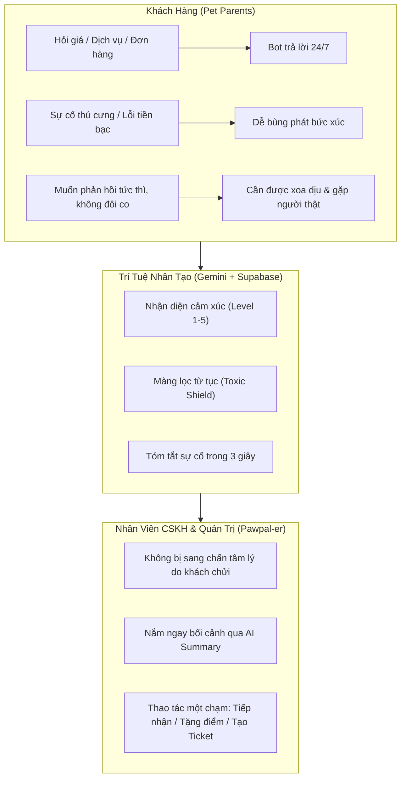
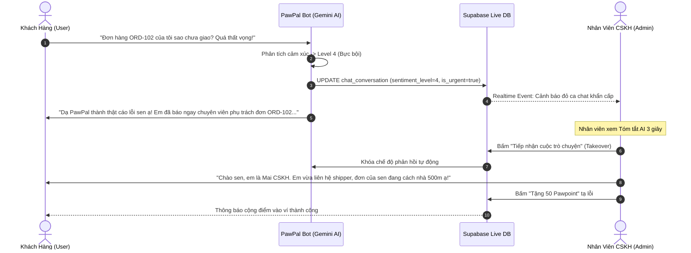
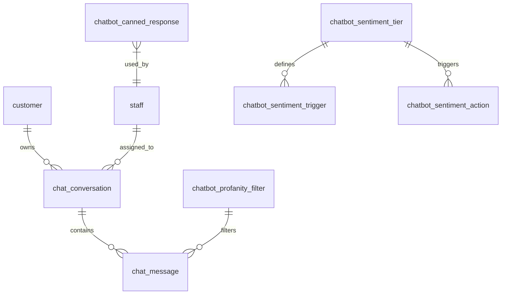
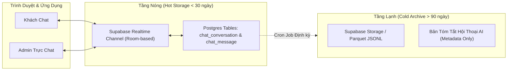
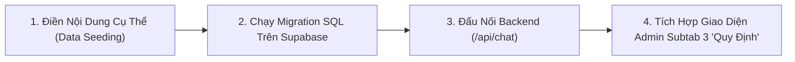
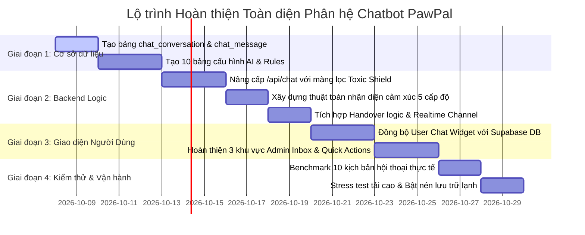

# KẾ HOẠCH TỔNG THỂ & KIẾN TRÚC PHÁT TRIỂN PHÂN HỆ CHATBOT & TRỰC CHAT CSKH THÔNG MINH PAWPAL

> **Tài liệu tham chiếu chuẩn hóa:** Dành cho Ban Quản trị, Kỹ sư Phát triển (Frontend & Backend) và Đội ngũ CSKH PawPal.  
> **Tuân thủ quy chuẩn:** AGENTS.md (100% Supabase Live DB - Zero JSON Mock - Giao diện phẳng 9px - Forest Green Palette).

---

## MỤC LỤC
1. [Phân Tích Đối Tượng Người Dùng & Nhu Cầu Cốt Lõi](#1-phân-tích-đối-tượng-người-dùng--nhu-cầu-cốt-lõi)
2. [Đánh Giá Khả Năng Đáp Ứng & Luồng Nâng Cấp Thông Minh](#2-đánh-giá-khả-năng-đáp-ứng--luồng-nâng-cấp-thông-minh)
   - 2.1. Nhận diện 5 Cấp độ Cảm xúc & Dự đoán Xu hướng Tương lai
   - 2.2. Điều hướng Thông minh & Bàn giao Nhân viên (Smart Handover)
   - 2.3. Màng lọc Bảo vệ Tâm lý Nhân sự (Toxic Shield & Gentle Reminder)
3. [Thiết Kế Cơ Sở Dữ Liệu Supabase & Đảm Bảo Toàn Vẹn Dữ Liệu](#3-thiết-kế-cơ-sở-dữ-liệu-supabase--đảm-bảo-toàn-vẹn-dữ-liệu)
   - 3.1. Các bảng Vận hành Hội thoại Thời gian thực (Conversational Tables)
   - 3.2. 10 Bảng Quản trị & Huấn luyện Brainstorm (AI Configuration & Rules)
   - 3.3. Ràng buộc Toàn vẹn Dữ liệu (Foreign Keys, Constraints & Indexes)
4. [Giải Pháp Xử Lý Khi Lượng Chat Quá Lớn (High-Volume Architecture)](#4-giải-pháp-xử-lý-khi-lượng-chat-quá-lớn-high-volume-architecture)
5. [Hướng Dẫn Các Bước Tiếp Theo Cho 10 Bảng Brainstorm](#5-hướng-dẫn-các-bước-tiếp-theo-cho-10-bảng-brainstorm)
6. [Lộ Trình Triển Khai Chi Tiết (4 Giai Đoạn)](#6-lộ-trình-triển-khai-chi-tiết-4-giai-đoạn)

---

## 1. PHÂN TÍCH ĐỐI TƯỢNG NGƯỜI DÙNG & NHU CẦU CỐT LÕI

Phân hệ Chatbot PawPal vận hành dựa trên triết lý **"Thú cưng là thành viên ruột thịt trong gia đình"**. Khác với thương mại điện tử đơn thuần, tâm lý khách hàng khi phát sinh sự cố thú cưng có mức độ xúc động và giận dữ cao gấp nhiều lần.



### 1.1. Đối tượng 1: Khách hàng (Pet Parents)
* **Đặc tính tâm lý:**
  - Coi thú cưng như con ruột. Khi bé bị trầy xước sau spa, dị ứng sau ăn pate, hoặc tiêm trễ lịch, bản năng bảo vệ con trỗi dậy làm mức độ căng thẳng tăng vọt.
  - Cực kỳ nhạy cảm với các lỗi giao dịch tài chính (MoMo đã trừ tiền nhưng app chưa báo, đơn hỏa tốc bị trễ giờ tiêm thuốc).
* **Nhu cầu tương tác:**
  - *Khi bình thường:* Cần tra cứu nhanh bảng giá theo cân nặng, chính sách gửi Hotel, tiến độ shipper giao hàng.
  - *Khi khiếu nại:* **Tuyệt đối không muốn nghe câu trả lời máy móc rập khuôn**. Muốn được lắng nghe, thấu cảm chân thành và được chuyển ngay đến chuyên viên con người.
  - *Khi mất bình tĩnh:* Cần được hệ thống "nhắc khéo" lịch thiệp để hạ hỏa, tránh việc vì quá nóng giận mà bị khóa tài khoản dịch vụ.

### 1.2. Đối tượng 2: Nhân viên CSKH & Thu ngân (Pawpal-er Agents)
* **Áp lực công việc:**
  - Tiếp xúc hàng chục ca chat căng thẳng mỗi ca trực. Nguy cơ kiệt sức tâm lý (burnout) cao khi liên tục đọc các từ ngữ xúc phạm, chửi thề từ khách nóng giận.
  - Mất thời gian đọc lại hàng chục dòng chat cũ để hiểu khách đang bị lỗi đơn nào, bé cún tên gì, dẫn đến trễ SLA phản hồi (>120s).
* **Nhu cầu tương tác:**
  - **Màng lọc bảo vệ tâm lý (Toxic Shield):** Hệ thống tự động che mờ từ ngữ thô tục, chỉ để lại bản tóm tắt sự việc khách quan.
  - **Tóm tắt ngữ cảnh AI 3 giây:** Vào phiên chat là biết ngay: "Khách tên A, bé Poodle Bông, lỗi giao trễ đơn ORD-8899, đề xuất bồi hoàn 50k".
  - **Hỗ trợ thao tác một chạm:** Không phải gõ phím thủ công lời xin lỗi, có sẵn thư viện mẫu, bấm nút nạp 50 điểm Pawpoint tạ lỗi hoặc bấm chuyển thẳng sang phân hệ Khiếu nại (Ticket).

---

## 2. ĐÁNH GIÁ KHẢ NĂNG ĐÁP ỨNG & LUỒNG NÂNG CẤP THÔNG MINH

### 2.1. Nhận diện 5 Cấp độ Cảm xúc & Dự đoán Xu hướng Tương lai

| Cấp độ | Tên gọi & Nhận diện | Biểu hiện Ngôn ngữ & Dấu hiệu | Hành động Tự động của Hệ thống |
| :---: | :--- | :--- | :--- |
| **Level 1** | **Hài lòng & Khen ngợi** | Lời cảm ơn, khen kỹ thuật viên mát tay, bé về rất thơm vui vẻ. | Bot cảm ơn thân thiện, mời đánh giá 5 sao hoặc tặng voucher lần sau. |
| **Level 2** | **Trung tính (Hỏi thông tin)** | Hỏi giờ mở cửa, bảng giá dịch vụ tắm sấy, thời gian giao hàng. | Bot tra cứu RAG Supabase trả lời chính xác, gợi ý đặt lịch. |
| **Level 3** | **Lo âu & Bất an** | Khách hỏi vì sao bé gãi tai nhiều sau tỉa lông, bé chưa chịu ăn hạt mới. | Bot gửi lời trấn an, nhắc các lưu ý thường gặp, đề xuất kỹ thuật viên gọi lại. |
| **Level 4** | **Bực bội & Thất vọng** | Giao trễ >2h, đã trừ tiền thẻ nhưng báo lỗi, viết hoa nhiều từ, dấu hỏi dồn dập `???`. | **Gắn nhãn Cần xử lý ngay**. Bot ngưng trả lời lý lẽ, xin lỗi chân thành, đẩy lên đầu Inbox Admin. |
| **Level 5** | **Giận dữ & Khẩn cấp** | Bé bị thương, chảy máu, đe dọa bóc phốt, văng tục thô lỗ, đòi gặp quản lý. | **Bật chuông cảnh báo khẩn cấp**. Che mờ từ tục, khóa quyền tự động của Bot, buộc nhân viên tiếp nhận trong 60s. |

#### 🔮 Dự đoán Xu hướng Cảm xúc Tương lai (Sentiment Trajectory Prediction)
Hệ thống tính toán chỉ số biến thiên cảm xúc:
* Nếu khách từ **Level 2 $\rightarrow$ Level 4** sau 1 câu trả lời của Bot: AI nhận định **"Kịch bản tư vấn gây bức xúc"**, tự động kích hoạt chuyển giao ngay trước khi khách bùng nổ lên Level 5.
* Dự đoán cảm xúc tương lai dựa trên lịch sử: Khách hàng từng có 2 khiếu nại trong quá khứ khi chat sẽ được hệ thống gán cờ `VIP Attention` ngay từ tin nhắn đầu tiên.

---

### 2.2. Điều hướng Thông minh & Bàn giao Nhân viên (Smart Handover)



---

### 2.3. Màng lọc Bảo vệ Tâm lý Nhân sự (Toxic Shield & Gentle Reminder)

1. **Phía Khách hàng (Nhắc khéo lịch thiệp):**
   - Lần 1 văng tục: Hiện banner nhẹ nhàng: *"PawPal luôn sẵn sàng hỗ trợ hết mình. Sen vui lòng giữ ngôn từ lịch thiệp để chuyên viên hỗ trợ nhanh nhất nhé ạ!"*
   - Lần 2 văng tục: Cảnh báo nghiêm túc: *"Hệ thống ghi nhận ngôn từ chưa phù hợp. Nếu tiếp tục, phiên chat sẽ tạm khóa 15 phút."*
   - Lần 3 văng tục: Khóa tạm thời 15 phút (`chat_blocked_until`), khung nhập liệu bị vô hiệu hóa kèm đồng hồ đếm ngược.

2. **Phía Nhân viên CSKH (Bảo vệ tâm lý):**
   - Từ ngữ thô tục được thay thế bằng nhãn: `[Nội dung đã được che mờ để bảo vệ tâm lý nhân sự]`.
   - Admin/Quản lý cấp cao có thể bấm nút "Xem nguyên văn" nếu cần lập biên bản pháp lý/khiếu nại nghiêm trọng.
   - Nhân viên chỉ tập trung vào thông tin cốt lõi do AI trích xuất (Mã đơn, Tên bé, Sự cố thực tế phát sinh).

---

## 3. THIẾT KẾ CƠ SỞ DỮ LIỆU SUPABASE & ĐẢM BẢO TOÀN VẸN DỮ LIỆU

Để loại bỏ hoàn toàn dữ liệu tạm và đảm bảo tính nhất quán dữ liệu cấp doanh nghiệp, hệ thống cần bổ sung các bảng sau trên Supabase.

### 3.1. Các bảng Vận hành Hội thoại Thời gian thực (Conversational Tables)

#### Bảng `chat_conversation` (Phiên hội thoại trực tuyến)
Quản lý vòng đời từng cuộc trò chuyện giữa Khách hàng, Bot và Nhân viên.

```sql
CREATE TABLE public.chat_conversation (
    id UUID PRIMARY KEY DEFAULT gen_random_uuid(),
    customer_id UUID REFERENCES public.customer(id) ON DELETE SET NULL,
    session_token VARCHAR(100), -- Dành cho khách vãng lai chưa đăng nhập
    status VARCHAR(20) DEFAULT 'bot_handling' CHECK (status IN ('bot_handling', 'waiting_agent', 'agent_handling', 'resolved', 'closed')),
    sentiment_level INT DEFAULT 2 CHECK (sentiment_level BETWEEN 1 AND 5),
    sentiment_trend VARCHAR(20) DEFAULT 'stable' CHECK (sentiment_trend IN ('escalating', 'stable', 'de_escalating')),
    is_urgent BOOLEAN DEFAULT false,
    assigned_staff_id UUID REFERENCES public.staff(id) ON DELETE SET NULL,
    ai_summary TEXT, -- Tóm tắt sự cố trong 3 giây
    internal_note TEXT, -- Ghi chú nội bộ bí mật của nhân viên
    sla_deadline TIMESTAMPTZ, -- Hạn chót phản hồi (SLA countdown)
    violation_count INT DEFAULT 0, -- Số lần văng tục
    blocked_until TIMESTAMPTZ, -- Thời điểm mở khóa chat
    created_at TIMESTAMPTZ DEFAULT timezone('utc'::text, now()) NOT NULL,
    updated_at TIMESTAMPTZ DEFAULT timezone('utc'::text, now()) NOT NULL
);

-- Index tăng tốc truy vấn theo trạng thái và độ khẩn cấp
CREATE INDEX idx_chat_conversation_status_urgent ON public.chat_conversation (status, is_urgent, updated_at DESC);
CREATE INDEX idx_chat_conversation_customer ON public.chat_conversation (customer_id);
```

#### Bảng `chat_message` (Từng tin nhắn trong cuộc hội thoại)
Lưu trữ toàn bộ dòng lịch sử trao đổi, hỗ trợ cờ che mờ từ ngữ thô tục.

```sql
CREATE TABLE public.chat_message (
    id UUID PRIMARY KEY DEFAULT gen_random_uuid(),
    conversation_id UUID NOT NULL REFERENCES public.chat_conversation(id) ON DELETE CASCADE,
    sender_type VARCHAR(10) NOT NULL CHECK (sender_type IN ('bot', 'customer', 'staff')),
    sender_id UUID, -- NULL nếu là bot, customer_id hoặc staff_id
    sender_name VARCHAR(100), -- Tên hiển thị (PawPal Bot, Tên nhân viên, Tên khách)
    content TEXT NOT NULL, -- Nội dung hiển thị sau khi lọc
    raw_content TEXT, -- Nội dung gốc (chỉ Admin cấp cao được xem khi cần lập biên bản)
    is_toxic BOOLEAN DEFAULT false, -- Đánh dấu nếu chứa từ ngữ thô tục
    sentiment_score NUMERIC(3, 2), -- Điểm cảm xúc câu này từ AI (-1.0 đến +1.0)
    metadata JSONB DEFAULT '{}'::jsonb, -- Đính kèm ID đơn hàng, ID lịch hẹn, ảnh chụp camera
    created_at TIMESTAMPTZ DEFAULT timezone('utc'::text, now()) NOT NULL
);

-- Index truy vấn tin nhắn theo phiên chat có sắp xếp thời gian
CREATE INDEX idx_chat_message_conversation ON public.chat_message (conversation_id, created_at ASC);
```

---

### 3.2. 10 Bảng Quản trị & Huấn luyện Brainstorm (AI Configuration & Rules)

Dưới đây là thiết kế chuẩn DDL Supabase cho **10 Bảng Brainstorm** thuộc 3 nhóm người dùng đã thảo luận:



#### NHÓM 1: CỐT LÕI HUẤN LUYỆN VÀ VẬN HÀNH CHATBOT
1. **Bảng 1: `chatbot_system_prompt` (Lời nhắc hệ thống và Nhân vật thương hiệu)**
   - Lưu trữ Prompt lõi, persona theo từng ngữ cảnh (Khách vãng lai, Khách VIP, Khách đang khiếu nại, Kênh nội bộ Admin Copilot).
   - *Cột:* `id (UUID)`, `prompt_key (VARCHAR)`, `channel (VARCHAR)`, `persona_name (VARCHAR)`, `tone_of_voice (VARCHAR)`, `content (TEXT)`, `is_active (BOOLEAN)`.
2. **Bảng 2: `chatbot_knowledge_faq` (Tri thức chính sách và Câu hỏi thường gặp)**
   - Cơ sở tri thức chuẩn để tạo vector embeddings đưa vào `document_embeddings`.
   - *Cột:* `id (UUID)`, `category (VARCHAR)`, `question (TEXT)`, `answer (TEXT)`, `keywords (TEXT[])`, `priority (INT)`, `last_reviewed_at (TIMESTAMPTZ)`.
3. **Bảng 3: `chatbot_profanity_filter` (Bộ lọc từ cấm và Từ khóa nhạy cảm)**
   - Danh sách từ thô tục, xúc phạm và từ khóa kích hoạt khẩn cấp (mất tiền, chảy máu, kiện tụng).
   - *Cột:* `id (UUID)`, `keyword (VARCHAR)`, `severity (VARCHAR: low/medium/high/critical)`, `action (VARCHAR: mask/warn/block/escalate)`, `replacement_text (VARCHAR)`.
4. **Bảng 4: `chatbot_canned_response` (Thư viện tin nhắn mẫu cho nhân viên tư vấn)**
   - Các mẫu phản hồi một chạm phân loại theo chủ đề (Xin lỗi giao trễ, Hướng dẫn gửi ảnh, Đền bù điểm, Chào tiếp nhận).
   - *Cột:* `id (UUID)`, `shortcut (VARCHAR)`, `title (VARCHAR)`, `content (TEXT)`, `category (VARCHAR)`, `usage_count (INT)`.

#### NHÓM 2: NHẬN DIỆN CẢM XÚC VÀ BẢO VỆ NHÂN SỰ
5. **Bảng 5: `chatbot_sentiment_tier` (Phân loại thang đo cảm xúc khách hàng)**
   - Định nghĩa 5 mức độ cảm xúc, màu sắc UI, thời gian giới hạn SLA phản hồi.
   - *Cột:* `level (INT PK)`, `name (VARCHAR)`, `color_badge (VARCHAR)`, `sla_seconds (INT)`, `description (TEXT)`.
6. **Bảng 6: `chatbot_sentiment_trigger` (Từ khóa cảm xúc và Ngữ cảnh kích hoạt)**
   - Biểu thức regex và từ khóa nhận diện cảm xúc.
   - *Cột:* `id (UUID)`, `tier_level (INT FK)`, `trigger_pattern (TEXT)`, `weight (NUMERIC)`, `context_domain (VARCHAR)`.
7. **Bảng 7: `chatbot_sentiment_action` (Kịch bản phản hồi và Hành động theo cảm xúc)**
   - Quy định Bot làm gì khi phát hiện cảm xúc (Level 4: Tự xin lỗi và ngưng biện hộ; Level 5: Bật chuông Admin).
   - *Cột:* `id (UUID)`, `tier_level (INT FK)`, `bot_behavior (VARCHAR)`, `notify_admin (BOOLEAN)`, `suggested_canned_id (UUID FK)`.
8. **Bảng 8: `chatbot_handover_rule` (Chuyển tiếp nhân viên và Màng lọc bảo vệ tâm lý)**
   - Các điều kiện tự động chuyển quyền từ Bot sang Người thật.
   - *Cột:* `id (UUID)`, `condition_name (VARCHAR)`, `trigger_type (VARCHAR)`, `threshold_value (VARCHAR)`, `auto_assign_role (VARCHAR)`.
9. **Bảng 9: `chatbot_compensation_policy` (Chính sách xoa dịu và Khung bồi hoàn thiện chí)**
   - Hạn mức tặng điểm Pawpoint / mã giảm giá mà nhân viên CSKH được quyền quyết định ngay trên màn hình chat.
   - *Cột:* `id (UUID)`, `issue_type (VARCHAR)`, `max_points (INT)`, `max_discount_vnd (NUMERIC)`, `approval_required (BOOLEAN)`.

#### NHÓM 3: LUỒNG HỘI THOẠI VÀ KIỂM THỬ TỔNG THỂ
10. **Bảng 10: `chatbot_scenario_matrix` (Ma trận kịch bản hội thoại theo tình huống)**
    - Tập dữ liệu benchmark kiểm thử độ chính xác của Bot trước khi deploy phiên bản prompt mới.
    - *Cột:* `id (UUID)`, `scenario_name (VARCHAR)`, `sample_user_input (TEXT)`, `expected_sentiment (INT)`, `expected_tool_call (VARCHAR)`, `expected_handover (BOOLEAN)`.

---

### 3.3. Ràng buộc Toàn vẹn Dữ liệu (Data Integrity Standards)
1. **Khóa Ngoại Tuyệt Đối (Foreign Key Integrity):**
   - Mọi tin nhắn `chat_message` đều liên kết chặt chẽ với `chat_conversation(id)` (`ON DELETE CASCADE`).
   - `customer_id` trỏ về `customer(id)` (`ON DELETE SET NULL`), đảm bảo nếu tài khoản khách hàng bị xóa dữ liệu theo yêu cầu bảo mật, biên bản hội thoại vẫn được giữ lại làm bằng chứng kiểm toán.
2. **Khóa Phân Quyền Hàng (Row Level Security - RLS):**
   - **Khách hàng:** Chỉ `SELECT` và `INSERT` được tin nhắn thuộc về các cuộc hội thoại mang `customer_id = auth.uid()`.
   - **Nhân viên / Quản trị viên:** Có toàn quyền đọc và phản hồi mọi cuộc hội thoại thông qua Role `staff` / `admin`.

---

## 4. GIẢI PHÁP XỬ LÝ KHI LƯỢNG CHAT QUÁ LỚN (HIGH-VOLUME ARCHITECTURE)

Khi hệ thống phát triển đạt hàng chục nghìn lượt chat mỗi ngày, nếu không có kiến trúc phân tầng, cơ sở dữ liệu sẽ bị chậm, cạn RAM và làm treo giao diện trực chat. Dưới đây là chiến lược kỹ thuật:



1. **Phân tầng Dữ liệu Nóng - Ấm - Lạnh (Data Tiering):**
   - **Dữ liệu Nóng (0 - 30 ngày gần nhất):** Lưu trực tiếp trong bảng Postgres chính với chỉ mục tối ưu, phục vụ nạp tức thì trong 50ms.
   - **Dữ liệu Ấm (31 - 90 ngày):** Lưu trữ trên cùng DB nhưng chỉ load khi người dùng chủ động bấm "Xem tin nhắn cũ" (phân trang Cursor-based).
   - **Dữ liệu Lạnh (> 90 ngày):** Tự động nén và chuyển vào bảng lưu trữ `chat_message_archive` hoặc xuất file JSONL lưu trên Supabase Storage. Chỉ giữ lại bản tóm tắt AI trên `chat_conversation` để tra cứu lịch sử.

2. **Phân vùng Bảng (PostgreSQL Table Partitioning):**
   - Bảng `chat_message` được phân vùng theo tháng (ví dụ: `chat_message_2026_10`, `chat_message_2026_11`) dựa trên cột `created_at`. Khi truy vấn ca chat hiện tại, Postgres chỉ quét đúng phân vùng của tháng đó, loại bỏ 95% chi phí I/O ổ đĩa.

3. **Phân trang Con trỏ (Cursor-based Pagination) thay vì Offset:**
   - Khi cuộn tin nhắn, frontend dùng: `WHERE conversation_id = ? AND created_at < ? ORDER BY created_at DESC LIMIT 20`. Tuyệt đối không dùng `OFFSET 1000` làm chậm hệ thống.

4. **Kỹ thuật Cắt tỉa Ngữ cảnh AI (Sliding Window & Context Compaction):**
   - Khi hội thoại vượt quá 15 tin nhắn, hệ thống không gửi toàn bộ lịch sử sang Gemini (tránh cạn quota và tốn chi phí).
   - Hệ thống tự động tạo 1 bản tóm tắt 2 câu về các nội dung cũ và chỉ gửi: `[Tóm tắt bối cảnh cũ] + [6 tin nhắn gần nhất]`. Tiết kiệm **80% chi phí Token** và giảm 60% thời gian phản hồi.

5. **Tối ưu Kênh Realtime (Room-based Channels):**
   - Thay vì subscribe sự kiện toàn bảng `postgres_changes`, mỗi ca chat mở ra một room channel riêng: `chat:conv_{conversation_id}`. Trình duyệt chỉ nhận đúng tin nhắn của ca chat đang mở, không bị nghẽn CPU khi hàng trăm khách cùng nhắn tin.

---

## 5. HƯỚNG DẪN CÁC BƯỚC TIẾP THEO CHO 10 BẢNG BRAINSTORM

Người dùng đã có khung sườn 10 bảng rất chuẩn mực. Các bước triển khai tiếp theo gồm:



### Bước 1: Điền nội dung mẫu vào từng bảng
* **Bảng 3 (Từ cấm):** Điền khoảng 30-50 từ vựng thô tục tiếng Việt thường gặp, các biến thể teencode, và từ khóa cảnh báo tài chính (`mất tiền`, `lừa đảo`, `chảy máu`, `chết`, `ngộ độc`).
* **Bảng 4 (Tin nhắn mẫu):** Soạn thảo sẵn 10-15 câu mẫu: Lời chào tiếp nhận, Lời xin lỗi giao trễ, Hướng dẫn kiểm tra vết tiêm, Lời tạ lỗi tặng điểm.
* **Bảng 9 (Khung đền bù):** Quy định rõ: Giao trễ >1h đền 50 điểm; Hủy hẹn do spa đền 100 điểm; Lỗi nhầm đơn đền 150 điểm + miễn phí hoàn hàng.

### Bước 2: Chạy Migration DDL trên Supabase
* Khởi tạo các bảng theo mã SQL được định nghĩa chi tiết tại Mục 3.
* Nạp dữ liệu cấu hình ban đầu (Seed Data).

### Bước 3: Đấu nối vào Backend Endpoint `/api/chat`
* Tích hợp hàm kiểm tra từ cấm (`checkProfanity`) trước khi lưu tin nhắn.
* Tích hợp hàm đánh giá cảm xúc tự động (Sentiment Analyzer) sau mỗi câu của khách.
* Tích hợp trigger kích hoạt chuyển trạng thái sang `waiting_agent`.

### Bước 4: Mở khóa Subtab 3: "Quy định" trên Giao diện Admin Chatbot
* Trong giao diện Admin phân hệ Chatbot (`pages/admin/modules/chatbot/chatbot.html`), subtab 3 mang mã `tab-chatbot-rules` hiện đã có layout cơ bản.
* Đấu nối bảng dữ liệu để Quản trị viên có thể trực tiếp:
  - Thêm / sửa danh sách từ cấm.
  - Chỉnh sửa thư viện tin nhắn mẫu một chạm.
  - Cập nhật khung bồi hoàn điểm Pawpoint.

---

## 6. LỘ TRÌNH TRIỂN KHAI CHI TIẾT (4 GIAI ĐOẠN)



### 🎯 Kết Quả Đạt Được Khi Hoàn Tất
1. **Khách hàng** luôn cảm thấy được trân trọng, không bị "bỏ rơi" trong vòng lặp trả lời tự động vô cảm.
2. **Nhân viên CSKH** được bảo vệ sức khỏe tinh thần 100%, thao tác xử lý sự cố nhanh gấp 3 lần nhờ AI Tóm tắt và công cụ Một chạm.
3. **Quản trị viên** nắm toàn quyền kiểm soát tri thức Bot, bộ lọc từ ngữ và chính sách đền bù ngay trên giao diện Quản trị chuẩn mực.
